────────────────────────────────────────────

                VIZCLICK

      A Creative Knowledge Ecology
         for Visual Creation

    Preserve creative meaning.
         Realize it everywhere.

         Created and maintained 
         by **Zuan Carreño**

<a href="https://www.youtube.com/watch?v=Oai7MdysBOA" target="_blank" rel="noopener noreferrer">
  
</a>

<p align="left">
  <i>▶ Watch a generated VizClick Prompt</i>
</p>

────────────────────────────────────────────

**License**
Apache License 2.0

**Status**
Active Research & Development
>
> VizClick is an open architecture for representing creative meaning independently of language, rendering technologies, and visualization systems.
>
> This document describes the philosophy, architecture, and guiding principles behind the project.

---
# Visual Knowledge Architecture

VizClick is a **Creative Knowledge Ecology (CKE)** for representing observable visual reality.

Rather than generating prompts, VizClick represents knowledge through deterministic, composable ontologies. This knowledge is transformed into Creative Intent and reconstructed by specialized adapters for AI image generation, AI video generation, 3D applications, game engines, and future visual technologies.


```text
                                   OBSERVABLE REALITY
                                            │
                          Observe • Classify • Abstract
                                            │
                                            ▼
                         Creative Knowledge Ecology (CKE)
                                            │
        ┌──────────────┬──────────────┬──────────────┬──────────────┐
        │              │              │              │              │
        │   Subject    │     Pose     │ Performance  │   Lighting   │
        │              │              │              │              │
        ├──────────────┼──────────────┼──────────────┼──────────────┤
        │              │              │              │              │
        │    Camera    │ Composition  │    Motion    │  Materials   │
        │              │              │              │              │
        ├──────────────┼──────────────┼──────────────┼──────────────┤
        │              │              │              │              │
        │ Environment  │   Weather    │    Color     │ Interaction  │
        │              │              │              │              │
        └──────────────┴──────────────┴──────────────┴──────────────┘
                                            │
                                            ▼
                                Activation Network
                                            │
                                            ▼
                               Creative Intent Graph
                                            │
                                            ▼
                                 VizClick Compiler
                                            │
      ┌─────────────────────────┬──────────────────────────┬──────────────────────────┐
      │                         │                          │                          │
      ▼                         ▼                          ▼                          ▼
Canonical Expansion     Knowledge Interpreter      Renderer Optimizer      Compiler Rules
                              │
      ┌───────────────────────┴────────────────────────────────────────────────────────┐
      │                                                                                │
      ▼                                                                                ▼
 Locale Interpreter                                                         Domain Interpreter

 EN • ES • PT • FR • DE                                             Photography • Cinema
 IT • JA • ZH • AR • HI                                              Animation • Fashion
                                                                      Architecture • Product
                                                                      Medical • Scientific
                                                                      Future Domains
      └───────────────────────┬────────────────────────────────────────────────────────┘
                              │
                              ▼
                    Reality Reconstruction Adapters
                              │
 ┌────────────────┬────────────────┬────────────────┬────────────────┬────────────────┐
 │                │                │                │                │                │
 │   AI Images    │    AI Video    │   3D & DCC     │ Game Engines   │ Future Systems │
 │                │                │                │                │                │
 │ • Krea         │ • Hailuo AI    │ • Blender      │ • Unreal       │ • Robotics     │
 │ • FLUX         │ • Kling        │ • Maya         │ • Unity        │ • CAD          │
 │ • Midjourney   │ • Seedance     │ • Houdini      │ • Godot        │ • Simulation   │
 │ • SDXL         │ • Veo          │ • Cinema 4D    │ • UEFN         │ • Digital Twin │
 │ • Seedream     │ • Runway       │ • OpenUSD      │ • Roblox       │ • XR / VR / AR │
 │ • Imagen       │ • Pika         │ • Omniverse    │                │ • Future AI    │
 │ • Ideogram     │ • Luma         │ • FreeCAD      │                │                │
 │ • Qwen Image   │                │                │                │                │
 └────────────────┴────────────────┴────────────────┴────────────────┴────────────────┘
                                            │
                                            ▼
                            Observable Reconstruction
                                            │
                                            ▼
                                Scene Inspector (VLM)
                                            │
                                            ▼
                           Observable Analysis Report
                                            │
                                            ▼
                         Human Validation / Research Loop
                                            │
                                            ▼
                         Creative Knowledge Ecology (CKE)
```

## Fundamental Principles

- Every Knowledge Object represents exactly one observable reality.
- Every ontology answers exactly one governing question.
- Ontologies remain independent and composable.
- Knowledge is immutable; transformations belong to the compiler.
- The Knowledge Interpreter translates canonical knowledge into linguistic and domain-specific representations.
- The Renderer Optimizer adapts those representations for each reconstruction technology.
- Reconstruction is analyzed, validated, and used to refine the Creative Knowledge Ecology through an empirical research loop.

> **VizClick does not teach machines how to generate images.**
>
> **VizClick teaches machines how to represent observable visual reality.**

**Knowledge is independent.**

**Reconstruction technologies are replaceable.**

**Observable reality is the reference.**


# VizClick

> ## A Creative Knowledge Ecology for Visual Creation
>
> **Preserve creative meaning. Realize it everywhere.**

---

# The Manifesto

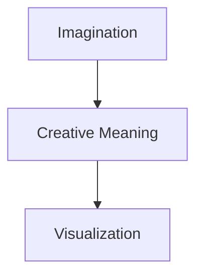

> **Creativity is timeless. Visualization is temporary. Meaning connects them.**

Every generation of creative technology introduces a new interface.

Brushes.

Cameras.

Editing software.

3D applications.

Node graphs.

Prompts.

Artificial intelligence.

Each transformed how creative work is expressed.

None changed what creativity is.

Creative direction has always been built upon timeless ideas:

- Intention
- Story
- Emotion
- Composition
- Lighting
- Performance
- Atmosphere
- Symbolism
- Movement

These concepts existed centuries before artificial intelligence.

They will continue to exist long after today's rendering technologies have disappeared.

VizClick exists because **creative knowledge should outlive every technology used to express it.**

Rather than teaching creators how to communicate with today's creative systems, VizClick seeks to enable future creative systems to understand the language creators have always spoken.
VizClick exists to preserve creative meaning by transforming abstract creative concepts into coherent observable representations.

Creative meaning alone is not sufficient.

A representation succeeds only when it can be faithfully reconstructed by independent rendering systems.

VizClick therefore optimizes every ontology for observable reality, rendering fidelity, and coherent visual representation.

## Observable Knowledge

Reality provides the observable vocabulary.

Creativity composes that vocabulary into new realities.

VizClick preserves canonical observable knowledge rather than prompts, interpretations, or implementation-specific instructions.

The same observable vocabulary can faithfully represent the physical world while serving as the foundation for coherent fictional worlds, impossible environments, and future forms of creative expression.

Reality provides the primitives.

Creativity composes the worlds.

---

# A Different Starting Point

Traditional creative AI begins here.

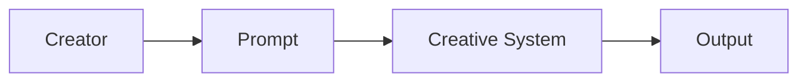

VizClick begins somewhere completely different.

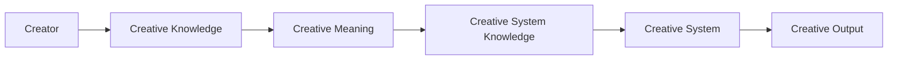

> **The creator should never have to think like a renderer.**

Prompts are only one possible representation of creative intent.

Tomorrow's creative systems may never use prompts at all.

VizClick therefore models creative meaning before any implementation exists.

---

# What is VizClick?

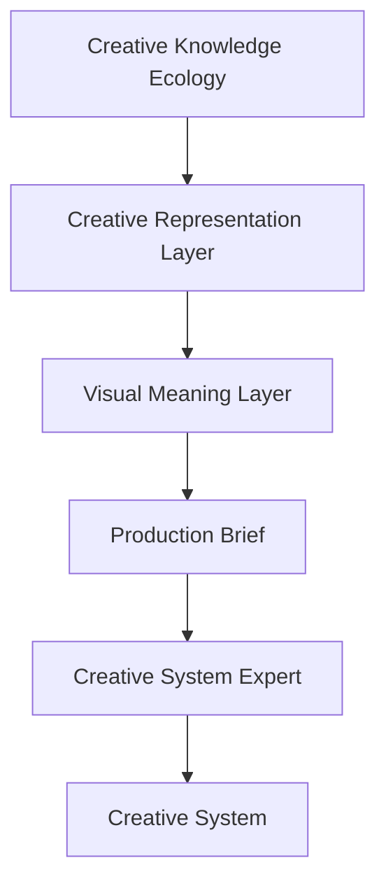

> **VizClick models meaning—not prompts.**

VizClick is not a prompt generator.

It is not an AI workflow.

It is not a rendering engine.

It is not tied to ComfyUI, Krea, FLUX, Qwen Image, Blender, Unreal Engine, Stable Diffusion, or any other visualization technology.

VizClick is a **Creative Knowledge Ecology** centered around a **Creative Representation Layer**.

Its purpose is to transform creative intent into structured semantic meaning that remains independent of language, AI models, rendering engines, visualization media, and future creative technologies.

Instead of describing **how** something should be generated, VizClick represents **why** it should exist.

It models:

- Meaning rather than syntax
- Knowledge rather than prompts
- Intent rather than implementation

---

# Creativity Outlives Technology

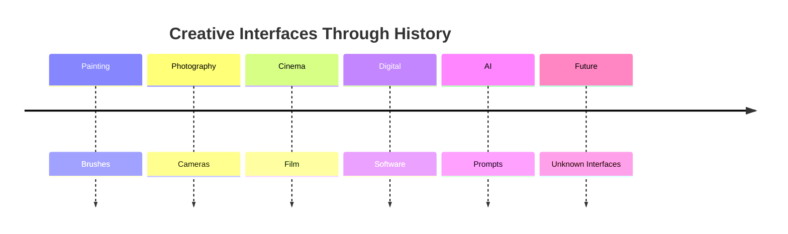

> **Technology evolves. Creativity endures.**

Every generation invents new creative tools.

Every generation introduces new interfaces.

Yet cinematographers still reason about light.

Photographers still reason about composition.

Actors still reason about performance.

Architects still reason about space.

Designers still reason about balance.

The tools evolve.

Creative thinking does not.

VizClick models that stable layer of creative knowledge rather than the rapidly changing technologies used to express it.

---

# The Creative Representation Layer

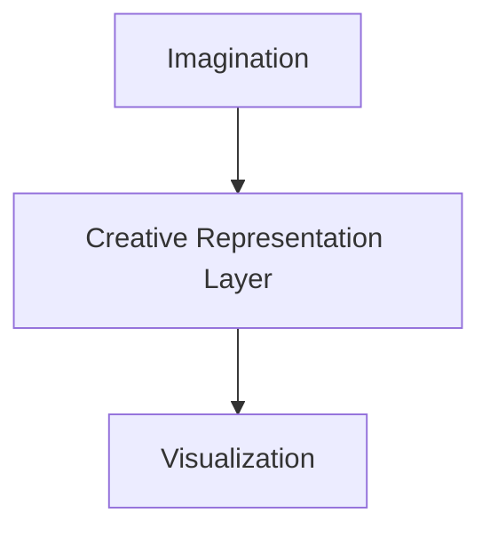

> **Meaning is the bridge between imagination and visualization.**

The Creative Representation Layer is the semantic heart of VizClick.

It exists independently of both the creator and the destination technology.

Imagination may originate from:

- A photographer
- A filmmaker
- A designer
- A creative team
- An autonomous AI
- Future creative collaborators

Visualization may become:

- An illustration
- A photograph
- A cinematic sequence
- A game
- A 3D environment
- An animation
- An immersive experience
- A robotic fabrication process
- A medium that does not yet exist

VizClick concerns itself with neither end of this pipeline.

Its responsibility is preserving the creative meaning that connects them.

# Observable Representation

Creative concepts are inherently abstract.

Renderers, however, reconstruct observable reality.

VizClick bridges these domains by transforming abstract creative meaning into coherent observable representations.

Every ontology therefore describes what can be observed rather than what must be interpreted.

Examples include:

- observable facial geometry
- observable lighting behavior
- observable material response
- observable spatial relationships
- observable atmospheric effects
- observable motion

This transformation allows Creative System Experts to communicate with rendering systems using coherent visual specifications rather than isolated semantic concepts.

VizClick separates knowledge from execution.

Observable knowledge remains stable and implementation-independent.

Creative intent is composed from this knowledge through the Activation Network.

Execution systems transform that intent into renderer-specific implementations without modifying the underlying knowledge.

This separation allows the same creative representation to be reused across image generation, video generation, simulation, robotics, game engines, CAD systems, XR experiences, and future creative technologies.
---

# A New Architectural Perspective

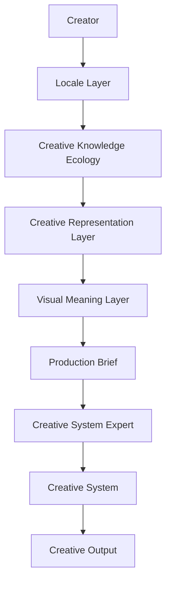

> **Creative systems evolve. Architecture should not.**

Each layer has a single responsibility.

| Layer | Responsibility |
|--------|----------------|
| **Locale Layer** | Understands the creator's language and cultural context. |
| **Creative Knowledge Ecology** | Models timeless creative knowledge. |
| **Creative Representation Layer** | Transforms creative intent into semantic meaning. |
| **Visual Meaning Layer** | Reasons about relationships between creative concepts. |
| **Production Brief** | Represents creative intent independently of any destination system. |
| **Creative System Expert** | Realizes the Production Brief for a specific creative system. |
| **Creative System** | Produces the final visualization. |

This separation allows creative knowledge to remain stable while creative technologies continue to evolve.

---

# Why VizClick Exists

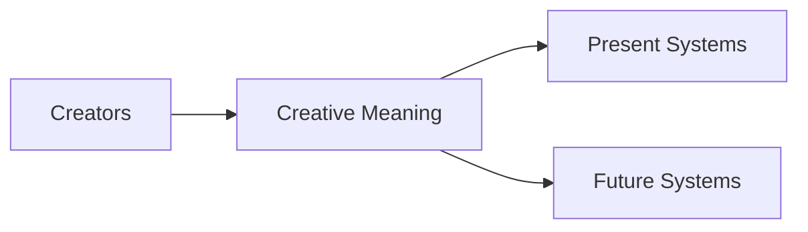

> **Creators should learn creativity once—not every new technology forever.**

Creative technologies will continue to evolve.

Interfaces will change.

Models will improve.

Rendering engines will come and go.

But creative meaning should remain stable.

VizClick exists to preserve that meaning while allowing every present and future creative system to realize it in its own language.

---

# Key Takeaways

- Creativity is older than technology.
- Meaning exists before implementation.
- Prompts are only one possible representation.
- Creative knowledge should remain stable.
- Creative systems should adapt to creators.
- VizClick preserves meaning while allowing every creative system to realize that meaning in its own language.

---

> **Preserve creative meaning. Realize it everywhere.**
# Chapter 2 — The Creative Knowledge Ecology

> **Creativity is an ecosystem, not a taxonomy.**

---
The Creative Knowledge Ecology (CKE) is a structured collection of canonical Observable Knowledge Objects.

Each Knowledge Object represents a deterministic observation of reality rather than a prompt, artistic interpretation, or renderer-specific instruction.

Knowledge Objects preserve measurable relationships between observable entities such as anatomy, optics, geometry, materials, motion, lighting, spatial composition, and environmental behavior.

The CKE therefore functions as a scientific knowledge representation for creative intelligence rather than a prompt library.

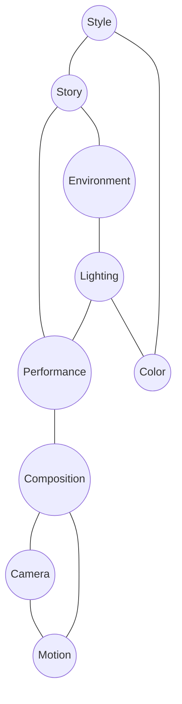

The central idea behind VizClick is surprisingly simple.

> **Creative knowledge evolves far more slowly than creative technology.**

Every generation invents new creative tools.

Painting.

Photography.

Cinema.

Computer graphics.

Game engines.

Artificial intelligence.

Future creative systems.

Each revolution changes **how** ideas are expressed.

None changes **what creativity is.**

A cinematographer still thinks about lighting.

A photographer still thinks about composition.

An actor still thinks about performance.

An architect still thinks about space.

A storyteller still thinks about narrative.

A designer still thinks about balance.

Technology evolves.

Creative knowledge accumulates.

VizClick is built upon this observation.

Rather than modeling today's creative systems, VizClick models the timeless body of knowledge shared by creators.

---

# Technology Changes. Creativity Endures.

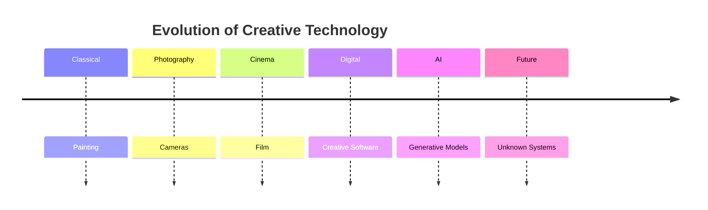


> **Interfaces evolve. Creative principles endure.**

Perspective did not disappear when photography was invented.

Lighting did not become obsolete when AI emerged.

Storytelling did not become irrelevant because prompts exist.

Every generation inherits centuries of creative knowledge.

VizClick preserves that continuity.

---

# Creativity Exists Before Technology

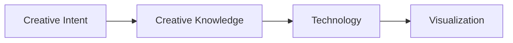

> **Technology realizes creativity. It does not define it.**

Creative intent always exists before technology.

Long before the first camera existed, painters reasoned about light.

Long before computer graphics existed, architects reasoned about perspective.

Long before diffusion models existed, filmmakers reasoned about emotional performance.

Technology changes.

Creative thinking does not.

VizClick therefore treats creativity as an independent body of knowledge rather than a byproduct of software.

Software becomes implementation.

Creativity remains the foundation.

---

# Beyond Prompt Engineering

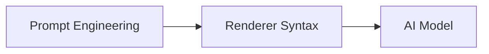

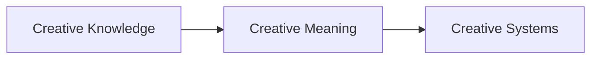

> **Prompt engineering optimizes syntax. Creative knowledge preserves meaning.**

Prompt engineering attempts to discover the language preferred by a particular creative system.

Creative knowledge seeks to describe the underlying intention independently of every implementation.

Consider this prompt:

> *cinematic golden hour portrait with shallow depth of field*

It may produce excellent results.

But it primarily describes implementation.

VizClick instead models concepts such as:

- Subject isolation
- Emotional intimacy
- Warm natural evening illumination
- Long focal length compression
- Calm narrative rhythm

The prompt is only one realization.

The meaning remains timeless.

---

# The Knowledge Domains

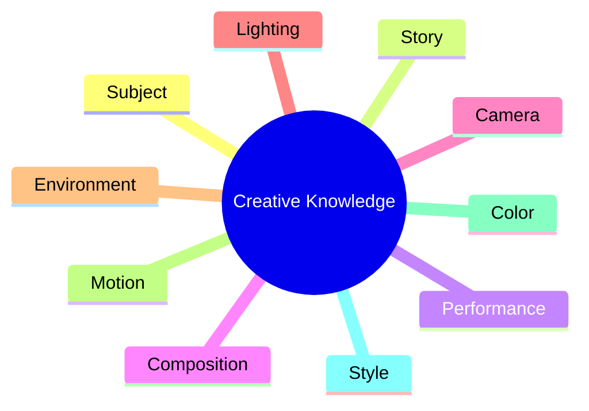

> **Creative knowledge is organized around how creators think—not how software is built.**

Every domain answers a different creative question.

| Domain | Question |
|----------|----------|
| Subject | What exists? |
| Story | Why does it exist? |
| Performance | How does it behave? |
| Composition | Where should attention go? |
| Camera | How should the audience experience it? |
| Lighting | How does light communicate? |
| Environment | Where does it happen? |
| Motion | How does it change? |
| Color | What emotion does it reinforce? |
| Style | How should it be interpreted? |

These domains are intentionally independent of any software, renderer, or AI model.

---

# Relationships Create Meaning

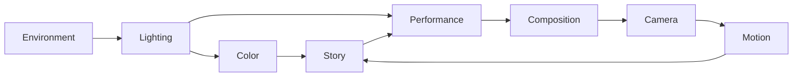

> **Meaning emerges from relationships—not isolated concepts.**

Traditional ontologies describe concepts.

An ecology describes interactions.

Lighting influences emotion.

Emotion shapes performance.

Performance changes composition.

Composition determines camera language.

Camera language reinforces narrative.

Narrative reshapes color.

Every creative decision influences many others.

Creativity is therefore not a collection of independent parameters.

It is an interconnected system.

---

# Stability Through Abstraction

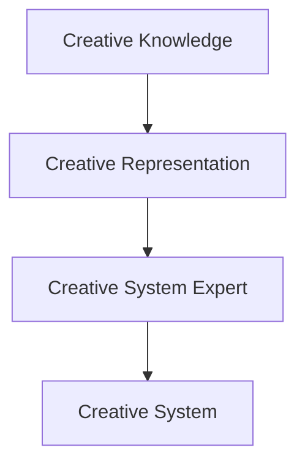

> **Creative knowledge remains stable while implementations evolve.**

A new renderer should never require redesigning the ontology.

A new AI model should never redefine composition.

A new visualization technology should never invalidate storytelling.

Instead, new technologies become new destinations capable of interpreting an already established semantic representation.

This separation allows VizClick to evolve indefinitely without abandoning its foundations.

---

# The Ecology Principle

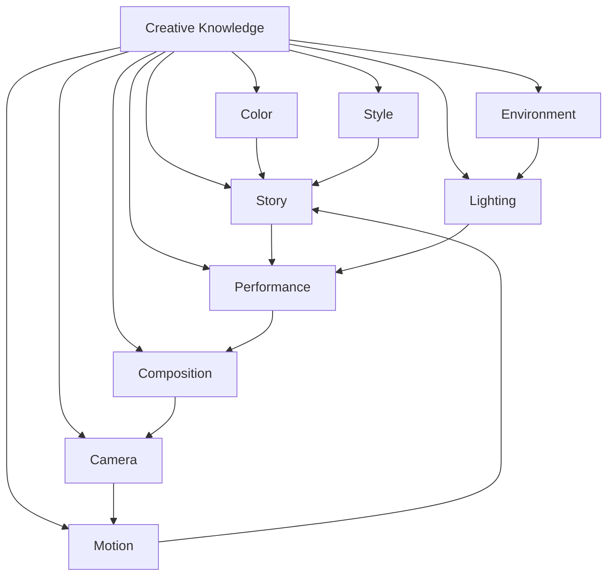

> **An ontology defines concepts. An ecology defines relationships.**

This distinction is fundamental.

An ontology answers:

> *What exists?*

An ecology answers:

> *How do things influence one another?*

Creativity is not a dictionary.

It is a living network of relationships.

VizClick therefore models creativity as an ecosystem rather than a static taxonomy.

---

# Key Takeaways

- Creative knowledge evolves far more slowly than technology.
- Creativity exists independently of software.
- Prompt engineering describes syntax.
- Creative knowledge preserves meaning.
- Meaning emerges from relationships.
- Creativity is an ecosystem.
- Stable knowledge enables adaptable creative systems.

---

> **Technology changes. Creative meaning endures.**
# Engineering Principles

VizClick engineering follows four fundamental principles.

## Preserve Creative Meaning

Creative concepts remain independent of renderers.

## Observable Representation

Abstract ideas are transformed into reconstructable visual states.

## Representation Coherence

Every observable property reinforces a single internally consistent representation.

## Rendering Fidelity

Every ontology descriptor exists to maximize the probability that a renderer reconstructs the intended visual result.
# Chapter 3 — The Semantic Bridge

> **Translation preserves words. Representation preserves meaning.**

---

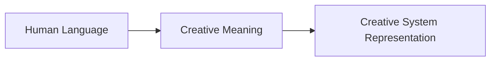

During the development of VizClick, an important observation emerged.

Creative communication does not occur in a single language.

Instead, it occurs across **three distinct semantic domains**:

- Human Language
- Creative Meaning
- Creative System Representation

Although these domains are often treated as interchangeable, they serve fundamentally different purposes.

Recognizing this distinction changes how creative systems should be designed.

---

## The Communication Problem

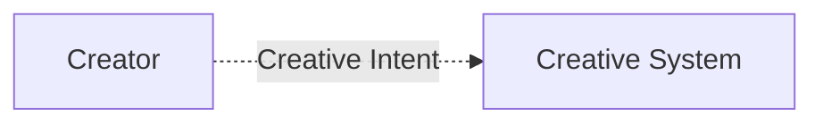

> **How does creative intent survive the journey between these two worlds?**

Creators naturally think in ideas.

Creative systems process structured representations.

Between them lies a semantic gap.

Today's workflows often ask creators to bridge that gap themselves.

They learn prompt syntax.

They memorize undocumented keywords.

They experiment with weighting systems.

They continually adapt to new rendering technologies.

VizClick proposes the opposite approach.

Creators should continue thinking creatively.

Creative systems should become better at understanding creators.

---

## Human Language

```mermaid
flowchart LR

    EN["Golden Hour"]
    ES["Hora Dorada"]
    FR["Heure Dorée"]
    JP["ゴールデンアワー"]
    ZH["黄金时刻"]

    Meaning["Creative Meaning"]

    EN --> Meaning
    ES --> Meaning
    FR --> Meaning
    JP --> Meaning
    ZH --> Meaning
```

> **Languages describe meaning. They do not define it.**

Creators naturally communicate using their own language.

English.

Spanish.

Chinese.

Japanese.

Arabic.

French.

German.

Portuguese.

Hindi.

Or countless regional creative vocabularies.

Different words often describe exactly the same creative concept.

VizClick therefore models semantic meaning rather than language itself.

---

## The Locale Layer

```mermaid
flowchart LR

    Creator["Creator"]

    Locale["Locale Layer"]

    Ecology["Creative Knowledge Ecology"]

    Creator --> Locale --> Ecology
```

> **Localization is semantic interpretation—not translation.**

The Locale Layer does much more than convert text between languages.

It understands:

- Language
- Regional terminology
- Professional vocabulary
- Cultural references
- Creative traditions

Its purpose is preserving meaning.

Translation converts words.

Semantic interpretation preserves creative intent.

---

## Creative Meaning

```mermaid
flowchart TD

    Expression["Human Expression"]

    Meaning["Creative Meaning"]

    Brief["Production Brief"]

    Expression --> Meaning --> Brief
```

> **Meaning exists independently of language.**

Creative meaning is the stable semantic layer inside VizClick.

It is not English.

It is not Chinese.

It is not JSON.

It is not Markdown.

It is not a prompt.

Meaning exists beneath every representation.

The Creative Knowledge Ecology defines concepts.

The Visual Meaning Layer organizes those concepts into creative intent.

The Production Brief preserves that intent independently of any destination technology.

---

## Creative System Representation

```mermaid
flowchart LR

    Brief["Production Brief"]

    Expert["Creative System Expert"]

    Representation["Optimized Representation"]

    System["Creative System"]

    Brief --> Expert --> Representation --> System
```

> **Every creative system has its own preferred representation.**

Creative systems differ enormously.

Some respond best to descriptive natural language.

Some perform better with structured JSON.

Others favor cinematic terminology, photography vocabulary, or domain-specific formats.

Future systems may require representations that do not yet exist.

Creators should never need to understand these differences.

Creative System Experts do.

---

## Representation Instead of Translation

```mermaid
flowchart LR

    Meaning["Creative Meaning"]

    Meaning --> Krea["Krea Expert"]
    Meaning --> Flux["FLUX Expert"]
    Meaning --> Qwen["Qwen Image Expert"]

    Krea --> KR["Optimized Krea Representation"]
    Flux --> FR["Optimized FLUX Representation"]
    Qwen --> QR["Optimized Qwen Representation"]
```

> **One meaning. Multiple representations.**

Creative meaning never changes.

Only its representation changes.

Each Creative System Expert understands the strengths, limitations, and preferred representation of its destination system.

Its responsibility is not to reinterpret meaning.

Its responsibility is to realize that meaning as effectively as possible.

---

## The Semantic Contract

```mermaid
flowchart LR

    Ecology["Creative Knowledge Ecology"]

    Meaning["Visual Meaning Layer"]

    Brief["Production Brief"]

    Expert["Creative System Expert"]

    System["Creative System"]

    Ecology --> Meaning --> Brief --> Expert --> System
```

> **Creative System Experts may change representation. They must never change meaning.**

This principle governs the entire VizClick architecture.

Experts evolve.

Documentation evolves.

Technical reports evolve.

Creative systems evolve.

Creative meaning remains stable.

This separation allows every Creative System Expert to improve independently while preserving the creator's original intent.

---

## Why This Matters

```mermaid
flowchart LR

    Creator["Creator"]

    Meaning["Creative Meaning"]

    Systems["Present and Future Creative Systems"]

    Creator --> Meaning --> Systems
```

> **Creators should learn creativity once—not every creative system forever.**

Every year, new creative systems emerge.

Each introduces new interfaces.

New prompting conventions.

New APIs.

New optimization techniques.

Without an intermediate semantic layer, creators must continually adapt.

VizClick reverses that relationship.

Creators remain focused on creativity.

Creative System Experts absorb the complexity of individual systems.

---

## Core Idea

- Human language is not creative meaning.
- Creative meaning is not a creative system representation.
- Translation preserves words.
- Representation preserves meaning.
- Every creative system has its own preferred representation.
- Creative System Experts specialize representations while preserving intent.
- Creators remain independent from individual rendering technologies.

---

> **Creators speak creatively. Creative systems operate through representations. VizClick understands both.**

# Chapter 4 — The Visual Meaning Layer

> **Knowledge becomes meaning before it becomes implementation.**

---
The Visual Meaning Layer does not describe artistic styles.

It represents relationships between observable entities.

Creative meaning emerges from these observable relationships, allowing the same semantic representation to remain valid across different execution systems and future rendering technologies.

```mermaid
flowchart LR

    Knowledge["Creative Knowledge"]
    Meaning["Visual Meaning Layer"]
    Brief["Production Brief"]

    Knowledge --> Meaning --> Brief
```

The Creative Knowledge Ecology represents **what creativity knows**.

The Visual Meaning Layer represents **what a creator intends**.

This distinction is fundamental.

Knowledge is timeless.

Intent exists only within a particular creative context.

The Visual Meaning Layer transforms timeless creative knowledge into a coherent semantic representation of a specific creative idea.

---

## From Knowledge to Intent

```mermaid
flowchart TD

    Knowledge["Creative Knowledge"]

    Relationships["Semantic Relationships"]

    Intent["Creative Intent"]

    Knowledge --> Relationships --> Intent
```

> **Knowledge alone does not create meaning. Relationships do.**

Knowing what lighting is does not define a scene.

Knowing what composition is does not tell a story.

Knowing what emotion is does not describe a performance.

Creative intent emerges from relationships.

The Visual Meaning Layer exists to model those relationships.

---

## Creativity Is Relational

```mermaid
graph TD

Story --> Performance
Performance --> Composition
Composition --> Camera
Camera --> Motion
Lighting --> Performance
Lighting --> Color
Environment --> Lighting
Color --> Story
Motion --> Story
```

> **Creative decisions rarely exist in isolation.**

Every creative decision influences another.

Lighting influences emotion.

Emotion influences performance.

Performance influences composition.

Composition influences camera language.

Camera language reinforces narrative.

Narrative influences atmosphere.

Atmosphere influences color.

Meaning emerges from this network of relationships rather than from isolated parameters.

---

## Beyond Parameters

Traditional creative software often represents projects as collections of independent settings.

```mermaid
graph LR

A["Camera"]

B["Lighting"]

C["Prompt"]

D["Seed"]

E["CFG"]

F["Steps"]

A --- B
C --- D
E --- F
```

These parameters describe implementation.

They do not explain intention.

VizClick instead represents creative objectives.

For example, rather than storing:

- 85 mm Lens
- f/1.4
- Warm Backlight
- Low Camera Angle

the Visual Meaning Layer models ideas such as:

- Create emotional intimacy.
- Separate the subject from the background.
- Suggest vulnerability.
- Reinforce optimism through natural evening light.

Technical implementation becomes the responsibility of the destination system.

---

## Reasoning Before Rendering

```mermaid
flowchart LR

Intent["Creative Intent"]

Consistency["Semantic Reasoning"]

Brief["Production Brief"]

Intent --> Consistency --> Brief
```

> **Reasoning occurs before implementation.**

One advantage of a semantic representation is that creative consistency can be evaluated before rendering.

For example,

if the story communicates hope,

but the lighting communicates despair,

the inconsistency can be detected.

If body language contradicts emotional intent,

that relationship can be identified.

If composition weakens the narrative,

alternative solutions can be explored.

The goal is not to replace artistic judgment.

The goal is to preserve creative intent.

---

## The Creative Graph

```mermaid
graph TD

Story

Character

Performance

Emotion

Gesture

Environment

Lighting

Composition

Camera

Motion

Color

Story --> Character

Character --> Performance

Performance --> Emotion

Performance --> Gesture

Story --> Environment

Environment --> Lighting

Lighting --> Composition

Composition --> Camera

Camera --> Motion

Motion --> Color
```

The Visual Meaning Layer can be understood as a semantic graph.

Every node represents meaning.

Every connection represents influence.

Changing one concept naturally propagates through related concepts.

This allows VizClick to reason about relationships rather than isolated properties.

---

## The Production Brief

```mermaid
flowchart LR

Knowledge["Creative Knowledge"]

Meaning["Visual Meaning Layer"]

Brief["Production Brief"]

Expert["Creative System Expert"]

Knowledge --> Meaning --> Brief --> Expert
```

> **The Production Brief is the canonical representation of creative intent.**

The Production Brief is not a prompt.

It is not JSON.

It is not Markdown.

It is not an API payload.

Those are serialization formats.

The Production Brief represents semantic intent independently of how it is eventually stored or transmitted.

Conceptually, it may include:

| Section | Purpose |
|----------|---------|
| Subject | What exists |
| Story | Why it exists |
| Performance | How it behaves |
| Composition | How attention is organized |
| Camera | How the audience experiences it |
| Lighting | How light communicates |
| Environment | Where it exists |
| Motion | How change occurs |
| Color | How emotion is reinforced |
| Style | How visual language is interpreted |
| Director Notes | Additional creative intent |

Every Creative System Expert receives the same Production Brief.

Only its representation changes.

---

## Stable Meaning, Flexible Representation

```mermaid
flowchart LR

Meaning["Creative Meaning"]

Brief["Production Brief"]

Krea["Krea Expert"]

Flux["FLUX Expert"]

Qwen["Qwen Image Expert"]

Meaning --> Brief

Brief --> Krea
Brief --> Flux
Brief --> Qwen
```

> **The Production Brief remains stable while implementations evolve.**

Rendering technologies will continue to evolve.

Prompt syntax will continue to evolve.

APIs will continue to evolve.

The Production Brief should not.

It represents something fundamentally more stable.

Creative intent.

This stability allows every future Creative System Expert to focus on realization rather than reconstruction.

---

## Core Idea

- Creative knowledge represents what creativity knows.
- The Visual Meaning Layer represents what the creator intends.
- Meaning emerges from relationships.
- Reasoning occurs before rendering.
- The Production Brief is the canonical representation of creative intent.
- Implementations evolve.
- Creative meaning remains stable.

---

> **The Visual Meaning Layer transforms creative knowledge into creative intent.**

# Chapter 5 — Deterministic Creative Reasoning

> **Creative meaning becomes reconstructable when its observable consequences are represented.**

---

The discoveries developed through the H3 creative-reasoning research revealed an important extension to the VizClick architecture.

The Creative Knowledge Ecology should not only know **what concepts exist**. It must also represent the relationships, observable states, spatial structure, temporal evolution, and cross-domain consequences through which a creative intention becomes reconstructable.

This is the layer between semantic intent and production realization.

```mermaid
flowchart TD

    Knowledge["Creative Knowledge"]
    Activation["Contextual Activation"]
    Relationships["Semantic Relationships"]
    Observable["Observable Representation"]
    Temporal["Temporal + Spatial State"]
    Brief["Production Brief"]
    Expert["Creative System Expert"]

    Knowledge --> Activation
    Activation --> Relationships
    Relationships --> Observable
    Observable --> Temporal
    Temporal --> Brief
    Brief --> Expert
```

> **VizClick does not merely describe creative concepts. It describes how those concepts become observable.**

---

## The Faithful & Enriched Approach

> **Faithfulness preserves creative meaning. Enrichment makes that meaning reconstructable.**

The first functional implementation of VizClick's creative-reasoning methodology established an important distinction between **faithful representation** and **enriched representation**.

This distinction is especially valuable for image and video prompt compilation, but the principle belongs to VizClick itself rather than to any particular renderer.

### Faithful Representation

The **Faithful** approach preserves the creator's explicit creative intent and constraints while translating them into deterministic, observable production information.

It should:

- preserve explicit user constraints;
- preserve reference-defined information;
- avoid unnecessary creative invention;
- resolve unspecified dimensions only when needed for coherent realization;
- express decisions as observable states rather than abstract adjectives.

### Enriched Representation

The **Enriched** approach preserves every explicit creative decision while introducing additional, contextually compatible information where that information materially improves reconstruction.

Enrichment is not decorative expansion.

It is **probability-informed creative inference**: selecting plausible, mutually compatible, visually expressive, physically coherent, and useful details from the available creative knowledge.

```mermaid
flowchart LR

    Intent["Explicit Creative Intent"]
    Faithful["Faithful Representation"]
    Enriched["Contextual Enrichment"]
    Observable["Observable Creative State"]
    Production["Production Representation"]

    Intent --> Faithful
    Faithful --> Observable
    Intent --> Enriched
    Enriched --> Observable
    Observable --> Production
```

> **The user remains the final creative authority.**

Faithful and enriched representations are therefore not competing interpretations. They are two levels of realization built from the same creative authority.

---

## Maximum Deterministic Information with Minimum Redundancy

> **The objective is not more words. It is more deterministic information.**

Creative reasoning becomes stronger when each representation contributes a distinct, observable constraint that can materially affect reconstruction.

VizClick therefore favors:

- explicit observable states;
- independently meaningful constraints;
- physical and spatial relationships;
- contextual specificity;
- cross-domain consequences;
- concise representations without repeated instructions.

It avoids:

- generic cinematic filler;
- repeated descriptions of the same state;
- duplicate camera or emotion instructions;
- contradictory enrichments;
- decorative detail that does not affect the result.

```mermaid
flowchart TD

    Meaning["Creative Meaning"]
    Information["Deterministic Information"]
    Redundancy["Redundancy Control"]
    Coherence["Coherent Representation"]
    Reconstruction["Reconstructable Result"]

    Meaning --> Information
    Information --> Redundancy
    Redundancy --> Coherence
    Coherence --> Reconstruction
```

> **Maximum deterministic information with minimum redundancy.**

This principle extends VizClick's concept of Observable Representation: the goal is not exhaustive description, but **high-information representation with low ambiguity**.

---

## Mandatory Spatial Layer Description

> **A scene is not a list of objects. It is a spatial relationship.**

Spatial structure is a first-class component of observable creative representation.

Whenever a scene contains meaningful spatial relationships, VizClick should represent:

- foreground;
- subject / primary action plane;
- middle ground;
- background;
- relative depth;
- spatial separation;
- subject-to-environment relationships;
- meaningful parallax and perspective relationships.

```mermaid
flowchart TD

    Scene["Scene"]
    Foreground["Foreground"]
    Subject["Subject / Action Plane"]
    Midground["Middle Ground"]
    Background["Background"]
    Depth["Spatial Depth + Relationships"]

    Scene --> Foreground
    Scene --> Subject
    Scene --> Midground
    Scene --> Background
    Foreground --> Depth
    Subject --> Depth
    Midground --> Depth
    Background --> Depth
```

The purpose is not to force every scene into a rigid template. It is to ensure that important spatial relationships are not silently delegated to unconstrained renderer inference.

Spatial reasoning connects directly to composition, camera, lighting, environment, motion, and continuity.

---

## Cross-Domain Robustness & Propagation

> **Creative knowledge is an ecology because creative decisions propagate.**

Knowledge domains should never be treated as isolated checklists.

When one meaningful domain is activated or enriched, VizClick evaluates its relevant consequences in connected domains.

```mermaid
flowchart TD

    Intent["Creative Intent"]

    Performance["Performance"]
    Motion["Motion"]
    Camera["Camera"]
    Framing["Framing"]
    Lighting["Lighting"]
    Sound["Sound"]
    Environment["Environment"]

    Intent --> Performance
    Performance --> Motion
    Performance --> Camera
    Motion --> Framing
    Motion --> Sound
    Environment --> Lighting
    Camera --> Framing
    Lighting --> Camera
```

For example, a running subject can produce meaningful consequences across:

`Performance → Motion → Wardrobe → Facial Performance → Camera → Framing → Sound → Environment`

A golden-hour decision can propagate through:

`Time → Lighting → Color → Atmosphere → Exposure → Shadow Behavior`

Propagation is **selective**, not exhaustive. VizClick propagates only consequences that materially improve the selected creative direction.

This produces robustness without turning the ontology into a checklist.

---

## Probabilistic Creative Reasoning

> **Reason probabilistically about the unspecified. Preserve certainty where the creator has already spoken.**

VizClick can use structured creative knowledge as a **probabilistic search space** when the creator leaves dimensions unspecified.

The process is:

```mermaid
flowchart TD

    Context["Semantic Context"]
    Candidates["Plausible Creative Candidates"]
    Compatibility["Cross-Domain Compatibility"]
    Coherence["Coherent Combination"]
    Observable["Observable Decision"]

    Context --> Candidates
    Candidates --> Compatibility
    Compatibility --> Coherence
    Coherence --> Observable
```

Probabilistic reasoning does **not** mean randomness.

It means selecting the strongest contextually compatible interpretation from plausible alternatives while respecting the certainty hierarchy:

```text
Explicit user information
        ↓
Reference-defined information
        ↓
Strong contextual implications
        ↓
Probabilistic enrichment of unspecified dimensions
```

When several interpretations are equally plausible, prefer the one that creates the clearest coherent creative direction rather than unnecessary complexity.

---

## Natural Evolution Priority

> **When a state can evolve naturally, prefer evolution over artificial transition.**

For temporal creative work, especially video, VizClick prioritizes physically and narratively plausible evolution before introducing explicit transition mechanisms.

```mermaid
stateDiagram-v2

    [*] --> InitialState
    InitialState --> NaturalEvolution
    NaturalEvolution --> IntermediateState
    IntermediateState --> FinalState
    NaturalEvolution --> TransitionStrategy : only when necessary
    TransitionStrategy --> FinalState
    FinalState --> [*]
```

Natural evolution may include:

- body movement;
- facial movement;
- pose progression;
- object interaction;
- locomotion;
- environmental movement;
- camera movement;
- lighting evolution;
- atmospheric change;
- secondary motion;
- physical cause and effect.

Artificial transition mechanisms are introduced only when they are necessary, explicitly requested, or required to bridge states that cannot be connected naturally.

This principle is particularly important when reasoning from reference states: a reference image should be treated as **one observable moment in a temporal sequence**, not merely as an appearance target.

---

## The First Functional Pilot — ZH3-GPT + MiniMax H3

> **VizClick is renderer-independent. Its first pilot is deliberately renderer-specific.**

The first functional implementation of this reasoning methodology is **ZH3-GPT**, a text-only creative reasoning and prompt-writing system developed as a pilot around **MiniMax H3**.

MiniMax H3 is therefore the **first experimental pilot renderer**, not the definition of VizClick itself.

```mermaid
flowchart TD

    VizClick["VizClick Creative Knowledge Ecology"]
    Reasoning["Creative Reasoning Methodology"]
    ZH3["ZH3-GPT — First Functional Pilot"]
    Adapter["MiniMax H3 Renderer Adapter"]
    H3["MiniMax H3"]
    Future["Future Creative Systems"]

    VizClick --> Reasoning
    Reasoning --> ZH3
    ZH3 --> Adapter
    Adapter --> H3
    Reasoning --> Future
```

The pilot is valuable because it provides an empirical environment in which VizClick principles can be tested against real creative reconstruction tasks.

The implementation explores, among other things:

- Faithful versus Enriched representations;
- contextual category activation;
- cross-domain propagation;
- mandatory spatial layers;
- deterministic information density;
- probabilistic creative reasoning;
- anchor-to-path temporal reasoning;
- natural evolution priority;
- continuity across reference states;
- observable emotional and physical performance;
- renderer-specific prompt compilation.

The resulting knowledge feeds back into VizClick's renderer-independent architecture.

```mermaid
flowchart LR

    Hypothesis["Creative Hypothesis"]
    Pilot["ZH3-GPT + MiniMax H3"]
    Observation["Observed Reconstruction"]
    Validation["Human / System Validation"]
    Knowledge["Updated Creative Knowledge"]

    Hypothesis --> Pilot
    Pilot --> Observation
    Observation --> Validation
    Validation --> Knowledge
    Knowledge --> Hypothesis
```

> **The pilot tests the architecture. The architecture is not defined by the pilot.**

---

## Deterministic Representation

Creative systems reconstruct observable reality.

Therefore, abstract concepts must eventually become representations that can be observed, evaluated, and reconstructed.

```mermaid
graph LR

    Abstract["Creative Meaning"]
    Semantic["Semantic State"]
    Visual["Visual State"]
    Physical["Physical State"]
    Temporal["Temporal State"]

    Abstract --> Semantic
    Semantic --> Visual
    Visual --> Physical
    Physical --> Temporal
```

A useful representation distinguishes between:

- what is explicitly known,
- what is established by reference,
- what is implied by relationships,
- what can be deterministically enriched,
- and what remains genuinely uncertain.

This distinction protects creative intent from arbitrary invention.

> **Enrichment should make meaning more reconstructable—not silently change what the creator meant.**

---

## Contextual Activation

The entire Creative Knowledge Ecology does not need to be activated for every scene.

A scene activates the knowledge domains required by its meaning.

```mermaid
flowchart TD

    Intent["Creative Intent"]

    Subject["Subject"]
    Performance["Performance"]
    Camera["Camera"]
    Lighting["Lighting"]
    Environment["Environment"]
    Motion["Motion"]
    Color["Color"]
    Story["Story"]

    Intent --> Subject
    Intent --> Performance
    Intent --> Camera
    Intent --> Lighting
    Intent --> Environment
    Intent --> Motion
    Intent --> Color
    Intent --> Story

    Performance --> Lighting
    Performance --> Camera
    Motion --> Camera
    Environment --> Lighting
    Story --> Performance
```

This produces an **Activation Network** rather than a flat checklist.

A close emotional portrait may strongly activate Performance, Emotion, Camera, Lighting, and Composition while leaving other domains largely dormant.

A moving architectural shot may activate Environment, Camera, Motion, Lighting, Materials, and Spatial Structure.

> **Knowledge is broad. Activation is contextual.**

---

## Cross-Domain Propagation

Creative decisions rarely remain inside one ontology.

```mermaid
graph TD

    Story["Story"] --> Performance["Performance"]
    Performance --> Emotion["Emotion"]
    Emotion --> Lighting["Lighting"]
    Emotion --> Gesture["Gesture"]
    Performance --> Composition["Composition"]
    Composition --> Camera["Camera"]
    Camera --> Motion["Motion"]
    Environment["Environment"] --> Lighting
    Environment --> Composition
    Lighting --> Color["Color"]
    Motion --> Camera
```

A change in one domain can create deterministic consequences in others.

For example:

**Story:** intimate confession

→ **Performance:** restrained body language

→ **Facial behavior:** sustained gaze, subtle mouth tension

→ **Camera:** closer framing and stable viewpoint

→ **Lighting:** controlled, intimate illumination

→ **Composition:** reduced visual distance between subject and audience

The system therefore reasons through **propagation**, not isolated keyword accumulation.

---

## Observable State Layers

A robust representation can be understood as several complementary layers.

```mermaid
flowchart TD

    Semantic["Semantic Layer"]
    Visual["Visual Layer"]
    Physical["Physical Layer"]
    Spatial["Spatial Layer"]
    Temporal["Temporal Layer"]
    Camera["Camera Layer"]
    Audio["Audio Layer"]
    Continuity["Continuity Layer"]
    Constraint["Constraint Layer"]

    Semantic --> Visual
    Visual --> Physical
    Physical --> Spatial
    Spatial --> Temporal
    Temporal --> Camera
    Camera --> Audio
    Audio --> Continuity
    Continuity --> Constraint
```

These layers should not be interpreted as a rigid serialization format.

They are reasoning dimensions that help the compiler determine what must remain coherent during reconstruction.

### Semantic Layer

What the scene means.

### Visual Layer

What should be visibly observable.

### Physical Layer

How materials, anatomy, motion, light, and environmental behavior manifest.

### Spatial Layer

Where entities exist in relation to foreground, middleground, background, camera, and one another.

### Temporal Layer

How states evolve over time.

### Camera Layer

How the audience experiences the scene through viewpoint, framing, lens behavior, movement, and continuity.

### Audio Layer

How sound participates in the scene when the destination medium supports it.

### Continuity Layer

Which states, anchors, relationships, and identities must persist across time or shots.

### Constraint Layer

Which conditions must remain preserved during reconstruction.

> **A creative representation becomes robust when its important consequences remain coherent across layers.**

---

## Spatial Reasoning

Spatial structure is not decoration.

It is part of meaning.

```mermaid
flowchart TD

    Camera["Camera"]
    Foreground["Foreground"]
    Midground["Middleground"]
    Background["Background"]

    Camera --> Foreground
    Foreground --> Midground
    Midground --> Background
```

The representation should distinguish:

- foreground entities and occluders,
- primary subjects and their immediate relationships,
- environmental structures,
- background depth cues,
- parallax relationships,
- spatial emphasis,
- and important visibility/occlusion conditions.

This allows spatial enrichment to remain coherent instead of becoming a random collection of background details.

> **Space is represented relationally, not as a list of scenery.**

---

## Temporal Reasoning

A video is not a sequence of unrelated images.

It is a sequence of states connected by change.

```mermaid
stateDiagram-v2
    [*] --> StateA
    StateA --> StateB: controlled evolution
    StateB --> StateC: controlled evolution
    StateC --> [*]

    note right of StateA
        Initial observable state
    end note

    note right of StateB
        Intermediate state
    end note

    note right of StateC
        Target observable state
    end note
```

VizClick therefore distinguishes **state** from **path**.

A reference image can define a state.

A second reference can define another state.

The representation must also reason about the path connecting them.

> **Keyframes define states. Creative reasoning defines the path between them.**

---

## Anchor-to-Path Reasoning

The most reliable temporal transformations preserve stable visual anchors while allowing controlled change around them.

```mermaid
flowchart LR

    A["Reference State A"]
    Anchor["Shared Visual Anchors"]
    Path["Continuous Path"]
    B["Reference State B"]

    A --> Anchor
    Anchor --> Path
    Path --> B
```

Anchors may include:

- subject identity,
- pose relationships,
- spatial placement,
- camera relationship,
- major environmental structures,
- lighting direction,
- color relationships,
- material identity.

The path can then change what is intentionally changing while protecting what should remain stable.

This principle is especially important for image-to-video and reference-to-reference workflows.

---

## Continuity Before Transition

A transition is not automatically a solution to temporal change.

First establish whether the two states can evolve naturally.

```mermaid
flowchart TD

    A["State A"]
    Analyze["Analyze Shared State"]
    Natural["Natural Evolution"]
    Transition["Transition Mechanism"]
    B["State B"]

    A --> Analyze
    Analyze --> Natural
    Analyze --> Transition
    Natural --> B
    Transition --> B
```

The reasoning priority is:

1. preserve identity,
2. preserve spatial and camera coherence,
3. preserve important physical relationships,
4. determine what naturally changes,
5. introduce a transition mechanism only when the state difference requires it.

> **Continuity is the default. Transformation is an explanation for change.**

This distinction prevents transitions from becoming arbitrary visual effects.

---

## Natural Evolution

Many apparent transformations can be represented as ordinary physical or behavioral evolution.

A subject can walk rather than teleport.

A fabric can move rather than morph.

Ice can melt rather than suddenly disappear.

Light can change because the source moves rather than because the entire image changes color.

The representation should prefer a coherent causal path when one exists.

```mermaid
flowchart LR

    Cause["Observable Cause"]
    State1["Initial State"]
    Evolution["Natural Evolution"]
    State2["Resulting State"]

    Cause --> Evolution
    State1 --> Evolution
    Evolution --> State2
```

> **Natural evolution provides a stronger explanation than unexplained visual change.**

---

## Transition Strategy

When a transition is genuinely required, the mechanism should be compatible with the state difference.

```mermaid
flowchart TD

    StateA["State A"]
    Difference["State Difference"]
    Compatibility["Transition Compatibility"]
    Mechanism["Transition Mechanism"]
    StateB["State B"]

    StateA --> Difference
    Difference --> Compatibility
    Compatibility --> Mechanism
    Mechanism --> StateB
```

Transition reasoning considers:

- visual compatibility,
- physical plausibility within the creative world,
- camera coherence,
- spatial continuity,
- temporal continuity,
- material behavior,
- and the intended narrative meaning.

The transition is therefore an **explanation of change**, not merely an effect.

---

## Emotion as Observable Performance

Abstract emotion labels are insufficient for deterministic reconstruction.

```mermaid
flowchart LR

    Emotion["Emotional State"]
    Face["Facial Behavior"]
    Body["Body Language"]
    Eyes["Eye Behavior"]
    Gesture["Gesture"]
    Tension["Muscle Tension"]

    Emotion --> Face
    Emotion --> Body
    Emotion --> Eyes
    Emotion --> Gesture
    Emotion --> Tension
```

A representation such as **joy**, **fear**, or **confidence** can be a semantic starting point.

The reconstruction layer should then express the observable consequences:

- facial muscle behavior,
- gaze direction and stability,
- eyelid and brow configuration,
- mouth configuration,
- head position,
- posture,
- gesture,
- body tension,
- movement quality,
- relationship to camera,
- and relationship to other subjects.

> **Emotion becomes reconstructable when it becomes observable behavior.**

This makes Performance a first-class domain rather than a decorative addition to Subject.

---

## Positive-State Compilation

Constraints are often expressed negatively by creators:

- do not change the subject,
- do not move the camera,
- no water from above,
- do not introduce another character,
- do not alter the composition.

A renderer cannot always act directly on the concept of absence.

VizClick can compile such constraints into positive observable states.

```mermaid
flowchart LR

    Negative["Negative Constraint"]
    State["Required Positive State"]
    Representation["Observable Representation"]

    Negative --> State --> Representation
```

For example:

**Constraint:** preserve the camera.

**Positive state:** fixed locked-off viewpoint with stable framing throughout the shot.

**Constraint:** preserve the subject.

**Positive state:** stable identity, anatomy, clothing, and spatial relationship throughout the sequence.

This is more than prompt optimization.

It is a semantic compilation operation.

> **Constraints should become states whenever possible.**

---

## Conditioning Purity

VizClick separates creative reasoning from renderer conditioning.

```mermaid
flowchart TD

    Knowledge["Canonical Knowledge"]
    Reasoning["Creative Reasoning"]
    Intent["Deterministic Intent"]
    Expert["Creative System Expert"]
    Conditioning["Renderer Conditioning"]

    Knowledge --> Reasoning --> Intent --> Expert --> Conditioning
```

The canonical representation should not become contaminated by renderer-specific syntax, model quirks, or temporary implementation instructions.

This preserves the architectural boundary between:

**what should exist**

and

**how a particular system is asked to realize it**.

> **Renderer conditioning is downstream of meaning.**

---

## Enrichment Without Invention

Creative systems benefit from additional detail, but enrichment creates a dangerous boundary.

```mermaid
flowchart TD

    Intent["Explicit Creative Intent"]
    Reference["Reference Evidence"]
    Knowledge["Canonical Knowledge"]
    Enrichment["Deterministic Enrichment"]
    Invention["Unsupported Invention"]

    Intent --> Enrichment
    Reference --> Enrichment
    Knowledge --> Enrichment

    Enrichment --> Output["Observable Representation"]
    Invention -.-> Output
```

Valid enrichment should be supported by:

- explicit intent,
- reference evidence,
- canonical knowledge,
- physical or spatial relationships,
- temporal requirements,
- or deterministic consequences of already-established states.

Unsupported invention should remain outside the canonical representation.

Every enriched decision should be traceable to its source or reasoning path.

---

## Constraint Density and Redundancy

Robustness does not mean repeating every concept indefinitely.

Too little information produces ambiguity.

Too much redundant information can create competing instructions.

```mermaid
flowchart LR

    Sparse["Under-specified"]
    Robust["Deterministic Coverage"]
    Dense["Redundant / Conflicting"]

    Sparse --> Robust --> Dense
```

VizClick should seek **deterministic coverage** rather than maximal text.

A concept should be represented where its observable consequences matter.

Related domains may reinforce the same state, but the compiler should control redundancy.

> **Robust representation is sufficient, coherent, and traceable—not verbose for its own sake.**

---

## Camera as Semantic Knowledge

Camera decisions are not merely technical parameters.

They determine how the audience experiences the represented world.

```mermaid
graph TD

    Story["Story"] --> Viewpoint["Viewpoint"]
    Performance["Performance"] --> Viewpoint
    Composition["Composition"] --> Framing["Framing"]
    Viewpoint --> Framing
    Framing --> Lens["Lens / Optical Relationship"]
    Lens --> Movement["Camera Movement"]
    Movement --> Motion["Subject Motion Relationship"]
```

Camera reasoning can therefore include:

- viewpoint,
- framing,
- subject-camera relationship,
- focal-length implications,
- depth and compression,
- camera height,
- movement,
- movement relative to subject movement,
- and continuity across time.

> **The camera is part of creative meaning because viewpoint changes meaning.**

---

## Motion as a Relational Domain

Motion is not simply an animation parameter.

It is a relationship between entities and time.

```mermaid
flowchart TD

    Subject["Subject Movement"]
    Camera["Camera Movement"]
    Environment["Environmental Movement"]
    Physics["Physical Response"]
    Motion["Observable Motion"]

    Subject --> Motion
    Camera --> Motion
    Environment --> Motion
    Physics --> Motion
```

A useful motion representation can include:

- direction,
- speed,
- acceleration,
- movement quality,
- trajectory,
- interaction,
- camera relationship,
- environmental response,
- motion blur,
- and temporal continuity.

This allows intention to emerge from motion rather than treating motion as an afterthought.

---

## Workflow as a State Machine

Different reconstruction workflows impose different reasoning requirements.

```mermaid
stateDiagram-v2
    [*] --> ImageState
    ImageState --> VideoState: temporal reconstruction
    ImageState --> ImageState: image refinement
    VideoState --> VideoState: temporal continuation
    VideoState --> TransitionState: state transformation
    TransitionState --> VideoState: reconstructed continuation
```

The workflow determines which information is authoritative and which relationships must be preserved.

Examples include:

- text-to-image,
- image-to-image,
- text-to-video,
- image-to-video,
- reference-to-reference transformation,
- multi-shot continuation,
- and reconstruction from multiple anchors.

Workflow detection therefore becomes part of **compiler reasoning**, not merely a UI decision.

---

## Reference Authority

References can play different semantic roles.

```mermaid
graph LR

    Reference["Reference"] --> State["Observable State"]
    Reference --> Style["Visual Evidence"]
    Reference --> Identity["Identity Anchor"]
    Reference --> Target["Target State"]
```

VizClick should distinguish:

- state-defining references,
- identity references,
- style evidence,
- intermediate-state references,
- target-state references,
- and continuity anchors.

A reference is therefore not merely an image attachment.

It is a semantic source with a defined authority.

---

## Validation Before Rendering

The expanded reasoning model introduces a stronger validation loop.

```mermaid
flowchart LR

    Intent["Creative Intent"]
    Representation["Observable Representation"]
    Validation["Semantic Validation"]
    Production["Production Brief"]
    Reconstruction["Reconstruction"]
    Analysis["Observable Analysis"]
    Learning["Knowledge Refinement"]

    Intent --> Representation
    Representation --> Validation
    Validation --> Production
    Production --> Reconstruction
    Reconstruction --> Analysis
    Analysis --> Learning
    Learning --> Representation
```

Validation can occur before rendering and after reconstruction.

### Pre-reconstruction validation

Check whether the representation is:

- coherent,
- sufficiently deterministic,
- spatially consistent,
- temporally consistent,
- cross-domain consistent,
- and faithful to the stated intent.

### Post-reconstruction validation

Compare the reconstructed result against observable expectations.

The Scene Inspector can identify discrepancies and feed evidence back into the Creative Knowledge Ecology.

> **Reconstruction is an experiment. Observable output is evidence.**

---

## The Extended VizClick Reasoning Loop

The discoveries above extend the original architecture into a complete semantic-to-observable loop.

```mermaid
flowchart TD

    Reality["Observable Reality"]
    Knowledge["Creative Knowledge Ecology"]
    Activation["Activation Network"]
    Meaning["Creative Intent Graph"]
    Reasoning["Deterministic Creative Reasoning"]
    Observable["Observable Representation"]
    Compiler["VizClick Compiler"]
    Brief["Production Brief"]
    Expert["Creative System Expert"]
    Reconstruction["Reality Reconstruction Adapter"]
    Output["Observable Reconstruction"]
    Inspector["Scene Inspector"]
    Validation["Human Validation / Research Loop"]

    Reality --> Knowledge
    Knowledge --> Activation
    Activation --> Meaning
    Meaning --> Reasoning
    Reasoning --> Observable
    Observable --> Compiler
    Compiler --> Brief
    Brief --> Expert
    Expert --> Reconstruction
    Reconstruction --> Output
    Output --> Inspector
    Inspector --> Validation
    Validation --> Knowledge
```

> **VizClick is a closed-loop creative knowledge system.**

It observes.

It represents.

It activates.

It reasons.

It compiles.

It reconstructs.

It analyzes.

It learns.

The architecture therefore remains independent of any individual rendering technology while becoming increasingly capable of representing the conditions required for faithful creative reconstruction.

---

## Core Idea

- Creative knowledge represents stable observable concepts.
- Faithful representation preserves explicit creative authority.
- Enriched representation adds only contextually justified information.
- Maximum deterministic information should be expressed with minimum redundancy.
- Spatial structure is a first-class layer of observable representation.
- Activation determines which knowledge matters in context.
- Relationships create creative meaning.
- Cross-domain propagation preserves consequences across the ecology.
- Observable representation describes the consequences of that meaning.
- Spatial and temporal states make change reconstructable.
- Cross-domain propagation preserves coherence.
- Performance translates emotion into observable behavior.
- Camera and motion are semantic domains.
- Constraints can be compiled into positive states.
- Enrichment must remain deterministic and traceable.
- Renderer conditioning remains downstream.
- Validation closes the loop between representation and reality.

---

> **Represent meaning. Reason through its consequences. Reconstruct it everywhere.**

# Chapter 6 — Creative System Experts

> **Every creative system is different. Every creative system deserves an expert.**

---

```mermaid
flowchart LR

    Brief["Production Brief"]

    Expert["Creative System Expert"]

    System["Creative System"]

    Output["Creative Output"]

    Brief --> Expert --> System --> Output
```

The Production Brief intentionally remains independent of every creative system.

It describes **what** should be expressed.

A Creative System Expert determines **how** that intent should be realized for a specific destination.

This separation allows VizClick to preserve creative meaning while embracing the unique characteristics of every creative system.

The Production Brief is a Creative Intermediate Representation (Creative IR).

It does not store prompts.

It stores deterministic compositions of Observable Knowledge Objects that collectively describe the intended observable state to be reconstructed by an execution system.
---

## Why Experts?

```mermaid
flowchart LR

    Meaning["Creative Meaning"]

    Krea["Krea"]

    Flux["FLUX"]

    Qwen["Qwen Image"]

    Midjourney["Midjourney"]

    Blender["Blender"]

    Meaning --> Krea
    Meaning --> Flux
    Meaning --> Qwen
    Meaning --> Midjourney
    Meaning --> Blender
```

> **Creative systems do not think the same way.**

Every creative system develops its own strengths.

Some excel at cinematic realism.

Others produce exceptional illustrations.

Some understand photography vocabulary.

Others respond better to descriptive language.

Some expose rich APIs.

Others only accept prompts.

These differences should not be hidden.

They should be understood.

Rather than forcing every creative system into a common interface, VizClick allows each system to be represented by its own Expert.

---

## An Expert Is More Than An Adapter

```mermaid
flowchart LR

    Adapter["Adapter"]

    Expert["Creative System Expert"]

    Adapter -->|"Converts"| Output1["Representation"]

    Expert -->|"Reasons"| Output2["Optimized Representation"]
```

> **Adapters convert. Experts reason.**

An adapter typically performs a technical transformation.

A Creative System Expert performs semantic reasoning.

It asks questions such as:

- What terminology does this system understand best?
- Which concepts should be explicit?
- Which concepts should remain implicit?
- Which representation produces the most faithful realization?

Its goal is not simply compatibility.

Its goal is semantic fidelity.

---

## The Knowledge Behind Every Expert

```mermaid
flowchart TD

    Docs["Official Documentation"]

    Reports["Technical Reports"]

    Papers["Research Papers"]

    Releases["Release Notes"]

    Community["Validated Community Knowledge"]

    Knowledge["Creative System Knowledge"]

    Docs --> Knowledge
    Reports --> Knowledge
    Papers --> Knowledge
    Releases --> Knowledge
    Community --> Knowledge
```

> **Experts are evidence-driven.**

Every Creative System Expert is built upon a dedicated body of knowledge.

This may include:

- Official documentation
- Technical reports
- Academic publications
- API specifications
- Release notes
- Validated community practices

Rather than relying on folklore or prompt experimentation alone, Experts continuously evolve using reliable sources of information.

---

## The Expert Workflow

```mermaid
flowchart LR

    Brief["Production Brief"]

    Analyze["Analyze Intent"]

    Optimize["Optimize Representation"]

    Validate["Validate Consistency"]

    Render["Creative System"]

    Brief --> Analyze --> Optimize --> Validate --> Render
```

A Creative System Expert follows a reasoning process.

It first understands the semantic intent contained within the Production Brief.

It then determines how that intent should be represented for the destination system.

Finally, it validates that the resulting representation remains faithful to the original creative meaning.

---

## Every Expert Is Independent

```mermaid
flowchart TD

    Brief["Production Brief"]

    Brief --> Krea["Krea Expert"]
    Brief --> Flux["FLUX Expert"]
    Brief --> Qwen["Qwen Image Expert"]
    Brief --> Blender["Blender Expert"]
    Brief --> Unreal["Unreal Expert"]
```

> **Adding a new Expert should never require changing the architecture.**

The Creative Knowledge Ecology remains stable.

The Visual Meaning Layer remains stable.

The Production Brief remains stable.

Only a new Expert is introduced.

This allows VizClick to evolve indefinitely as new creative technologies emerge.

---

## Krea Expert V1

```mermaid
flowchart LR

    Brief["Production Brief"]

    KreaExpert["Krea Expert"]

    KreaKnowledge["Krea System Knowledge"]

    Renderer["Krea"]

    Brief --> KreaExpert
    KreaKnowledge --> KreaExpert
    KreaExpert --> Renderer
```

The first reference implementation of VizClick is the **Krea Expert**.

Krea was selected because it provides a rich foundation for semantic optimization through its public technical documentation, creative-first philosophy, and evolving rendering capabilities.

The Krea Expert serves as the initial demonstration of how Creative System Experts can preserve creative meaning while optimizing representation for a specific destination.

Future Experts may support additional systems without requiring any changes to the Creative Knowledge Ecology.

---

## Growing the Ecosystem

```mermaid
mindmap
  root((Creative System Experts))

    Krea

    FLUX

    Qwen Image

    Midjourney

    Blender

    Unreal Engine

    Future Systems
```

VizClick is intentionally designed as an open architecture.

As new creative systems emerge, new Experts can be developed.

The architecture remains unchanged.

Only the ecosystem grows.

---

## Core Idea

- The Production Brief is independent of every creative system.
- Every creative system has unique strengths and preferred representations.
- Creative System Experts preserve semantic meaning while optimizing realization.
- Experts are built upon evidence rather than assumptions.
- New Experts extend the ecosystem without changing the architecture.

---

> **Creative meaning remains universal. Expertise is destination-specific.**

# Chapter 7 — The Production Brief

> **Creative intent deserves a canonical representation.**

---

```mermaid
flowchart LR

    Knowledge["Creative Knowledge Ecology"]
    Meaning["Visual Meaning Layer"]
    Brief["Production Brief"]
    Expert["Creative System Expert"]

    Knowledge --> Meaning --> Brief --> Expert
```

The Activation Network composes Observable Knowledge Objects into a deterministic creative representation.

Canonical knowledge remains immutable.

User intent, stylistic preferences, and renderer-specific adaptations are applied as transformations during compilation without modifying the underlying knowledge.

The Creative Knowledge Ecology provides creative knowledge.

The Visual Meaning Layer organizes that knowledge into creative intent.

The Production Brief preserves that intent.

It is the canonical representation exchanged throughout the VizClick architecture.

Every Creative System Expert receives the same Production Brief.

Only its realization changes.

---

## A Canonical Representation

```mermaid
flowchart LR

    Intent["Creative Intent"]

    Brief["Production Brief"]

    Prompt["Prompt"]
    JSON["JSON"]
    API["API Payload"]
    Graph["Node Graph"]

    Intent --> Brief

    Brief --> Prompt
    Brief --> JSON
    Brief --> API
    Brief --> Graph
```

> **The Production Brief is independent of how it is represented.**

A Production Brief is not a prompt.

It is not JSON.

It is not Markdown.

It is not XML.

It is not a node graph.

These are representations.

The Production Brief exists independently of every serialization format.

Its purpose is to preserve creative intent rather than implementation details.

---

## Why It Exists

```mermaid
flowchart LR

    Creator["Creator"]

    Meaning["Creative Intent"]

    Brief["Production Brief"]

    Systems["Creative Systems"]

    Creator --> Meaning --> Brief --> Systems
```

> **Creative intent should be described once and realized many times.**

Without a canonical representation, every Creative System Expert would need to reconstruct the creator's intent independently.

That duplication introduces inconsistency.

The Production Brief eliminates this problem by providing a stable semantic description that every Expert can interpret.

Meaning is defined once.

Representation is specialized many times.

---

## What the Production Brief Describes

```mermaid
mindmap
  root((Production Brief))

    Subject

    Story

    Performance

    Composition

    Camera

    Lighting

    Environment

    Motion

    Color

    Style

    Director Notes
```

The Production Brief organizes creative intent into semantic domains.

Rather than describing technical parameters, it describes creative objectives.

Typical sections include:

| Section | Purpose |
|----------|----------|
| Subject | What exists within the scene |
| Story | Why the scene exists |
| Performance | How characters behave |
| Composition | How attention is organized |
| Camera | How the audience experiences the scene |
| Lighting | How light communicates meaning |
| Environment | Where the scene exists |
| Motion | How movement contributes to storytelling |
| Color | How emotion is reinforced |
| Style | Which visual language guides interpretation |
| Director Notes | Additional creative guidance |

These sections describe intent rather than implementation.

---

## What It Does Not Contain

```mermaid
graph TD

Brief["Production Brief"]

Brief -->|"Not"| Seed["Random Seed"]

Brief -->|"Not"| CFG["CFG Scale"]

Brief -->|"Not"| Steps["Sampling Steps"]

Brief -->|"Not"| Resolution["Resolution"]

Brief -->|"Not"| Scheduler["Scheduler"]

Brief -->|"Not"| PromptSyntax["Prompt Syntax"]
```

> **Implementation belongs to the destination system.**

The Production Brief intentionally excludes renderer-specific parameters.

It does not describe:

- Sampling algorithms
- CFG values
- Random seeds
- Scheduler selection
- Prompt syntax
- API payload structure

Those concerns belong to the Creative System Expert.

Separating semantic intent from technical implementation allows the architecture to remain stable as rendering technologies evolve.

---

## Serialization Is Separate

```mermaid
flowchart LR

    Brief["Production Brief"]

    Serializer["Serializer"]

    JSON["JSON"]

    YAML["YAML"]

    XML["XML"]

    Prompt["Prompt"]

    Brief --> Serializer

    Serializer --> JSON
    Serializer --> YAML
    Serializer --> XML
    Serializer --> Prompt
```

> **Serialization is an implementation detail.**

A Production Brief may eventually be stored, transmitted, or exchanged in many formats.

For example:

- JSON
- YAML
- XML
- Markdown
- Binary formats
- Future serialization standards

None of these formats define the Production Brief.

They merely encode it.

Changing the serialization format should never require changing the underlying semantic model.

---

## Stability Across Time

```mermaid
flowchart LR

    Brief["Production Brief"]

    V1["System V1"]

    V2["System V2"]

    Future["Future Systems"]

    Brief --> V1
    Brief --> V2
    Brief --> Future
```

> **Representations evolve. Creative intent endures.**

Rendering technologies evolve continuously.

Prompt conventions change.

APIs change.

Optimization strategies change.

The Production Brief should remain stable despite these changes.

Its responsibility is preserving creative intent independently of any specific rendering technology.

---

## Architectural Responsibilities

```mermaid
flowchart LR

    Knowledge["Creative Knowledge Ecology"]

    Meaning["Visual Meaning Layer"]

    Brief["Production Brief"]

    Expert["Creative System Expert"]

    Renderer["Creative System"]

    Knowledge --> Meaning --> Brief --> Expert --> Renderer
```

Each architectural component has a single responsibility.

| Component | Responsibility |
|-----------|----------------|
| Creative Knowledge Ecology | Stores creative knowledge |
| Visual Meaning Layer | Organizes creative intent |
| Production Brief | Preserves semantic intent |
| Creative System Expert | Specializes representations |
| Creative System | Realizes the final output |

This separation allows every layer to evolve independently while preserving the overall architecture.

---

## A Stable Contract

```mermaid
sequenceDiagram

    participant VML as Visual Meaning Layer
    participant PB as Production Brief
    participant EXP as Creative System Expert
    participant SYS as Creative System

    VML->>PB: Create canonical intent
    PB->>EXP: Deliver semantic intent
    EXP->>SYS: Generate optimized representation
```

> **The Production Brief is the architectural contract between meaning and realization.**

Every Creative System Expert assumes that the Production Brief faithfully represents the creator's intent.

Every Expert is free to optimize its representation.

No Expert is permitted to redefine the meaning itself.

This distinction preserves consistency across every destination system.

---

## Core Idea

- The Production Brief is the canonical representation of creative intent.
- It preserves meaning independently of any rendering technology.
- It is not a prompt, JSON document, or API payload.
- Serialization formats encode the Production Brief but do not define it.
- Every Creative System Expert receives the same semantic intent.
- Implementations evolve while the Production Brief remains stable.

---

> **Creative meaning becomes portable when it has a stable representation.**

# Chapter 8 — Creative System Knowledge

> **Creative knowledge is timeless. Creative system knowledge evolves.**

---

```mermaid
flowchart LR

    CK["Creative Knowledge"]
    CM["Creative Meaning"]
    CSK["Creative System Knowledge"]

    CK --> CM --> CSK
```

VizClick distinguishes between three fundamentally different kinds of knowledge.

Creative Knowledge describes universal creative principles.

Creative Meaning represents the creator's intent within a particular context.

Creative System Knowledge explains how a specific creative system interprets that intent.

Separating these responsibilities allows the architecture to remain stable while continuously adapting to new technologies.

---

## Three Independent Domains

```mermaid
flowchart LR

    A["Creative Knowledge Ecology"]
    B["Visual Meaning Layer"]
    C["Creative System Knowledge"]

    A --> B --> C
```

> **Every layer evolves at a different pace.**

Creative knowledge changes slowly.

The principles of composition, storytelling, lighting, color theory, and visual communication have developed over centuries.

Creative meaning changes with every project.

Every scene, image, animation, or experience represents a new creative objective.

Creative System Knowledge changes continuously.

Rendering models evolve.

APIs evolve.

Prompt behavior evolves.

Optimization techniques evolve.

Each layer therefore requires its own lifecycle.

---

## What Is Creative System Knowledge?

```mermaid
mindmap
  root((Creative System Knowledge))

    Documentation

    Technical Reports

    Research Papers

    APIs

    Release Notes

    Model Behavior

    Prompt Patterns

    Best Practices

    Community Validation
```

Creative System Knowledge is the body of information required to communicate effectively with a specific creative system.

It is not concerned with artistic theory.

It is concerned with implementation.

Examples include:

- Official documentation
- Technical reports
- API specifications
- Model capabilities
- Supported features
- Prompt behavior
- Optimization techniques
- Version-specific changes
- Validated community discoveries

This knowledge allows an Expert to produce high-quality representations without changing the creator's original intent.

---

## Knowledge Has a Lifecycle

```mermaid
flowchart LR

    Release["New Model Release"]

    Research["Research"]

    Documentation["Documentation"]

    Validation["Validation"]

    Expert["Creative System Expert"]

    Release --> Research
    Research --> Documentation
    Documentation --> Validation
    Validation --> Expert
```

> **Experts improve by learning, not by rewriting architecture.**

Creative systems continuously evolve.

A new model release may introduce:

- New capabilities
- Better prompt interpretation
- Different APIs
- New parameters
- Deprecated features
- Improved rendering behavior

Rather than modifying the Creative Knowledge Ecology or the Visual Meaning Layer, VizClick updates the corresponding Creative System Knowledge.

The architecture remains stable.

Only the Expert becomes more capable.

---

## Knowledge Sources

```mermaid
graph TD

Official["Official Documentation"]

Reports["Technical Reports"]

Research["Academic Research"]

API["API Specifications"]

Release["Release Notes"]

Community["Validated Community Knowledge"]

Official --> ExpertKnowledge["Creative System Knowledge"]
Reports --> ExpertKnowledge
Research --> ExpertKnowledge
API --> ExpertKnowledge
Release --> ExpertKnowledge
Community --> ExpertKnowledge
```

> **Reliable Experts are built upon reliable knowledge.**

Creative System Knowledge is assembled from multiple complementary sources.

Official documentation explains intended behavior.

Technical reports reveal implementation insights.

Research papers describe underlying techniques.

API documentation defines available interfaces.

Release notes document change over time.

Validated community experience captures practical observations that may not yet appear in official documentation.

Together, these sources provide a continuously evolving knowledge base for each Expert.

---

## Every Expert Has Its Own Knowledge

```mermaid
flowchart TD

    Krea["Krea Expert"]
    Flux["FLUX Expert"]
    Qwen["Qwen Image Expert"]

    KK["Krea Knowledge"]
    FK["FLUX Knowledge"]
    QK["Qwen Knowledge"]

    KK --> Krea
    FK --> Flux
    QK --> Qwen
```

> **Experts share architecture, not knowledge.**

Every Creative System Expert follows the same architectural principles.

What differs is the knowledge it applies.

A Krea Expert understands Krea.

A FLUX Expert understands FLUX.

A Qwen Image Expert understands Qwen Image.

Each Expert develops independently while remaining compatible with the same Production Brief.

---

## Continuous Learning

```mermaid
flowchart LR

    Observe["Observe"]

    Evaluate["Evaluate"]

    Validate["Validate"]

    Integrate["Integrate"]

    Knowledge["Creative System Knowledge"]

    Observe --> Evaluate
    Evaluate --> Validate
    Validate --> Integrate
    Integrate --> Knowledge
```

> **Knowledge should improve through evidence.**

New information should not automatically become part of an Expert.

Instead, it progresses through a reasoning process.

Observation identifies new information.

Evaluation determines relevance.

Validation confirms reliability.

Integration updates the Expert's knowledge.

This approach favors evidence over assumptions and helps maintain consistent behavior over time.

---

## Stable Architecture, Evolving Intelligence

```mermaid
flowchart LR

    Architecture["VizClick Architecture"]

    Expert["Creative System Expert"]

    Knowledge["Creative System Knowledge"]

    Updates["Continuous Updates"]

    Updates --> Knowledge
    Knowledge --> Expert
    Architecture --> Expert
```

The VizClick architecture is intentionally stable.

Creative System Knowledge is intentionally dynamic.

As rendering technologies evolve, Experts continue to improve without requiring changes to the overall architecture.

This separation allows innovation to occur where it is most valuable while preserving long-term architectural consistency.

---

## The Knowledge Boundary

```mermaid
flowchart LR

    CK["Creative Knowledge"]

    CM["Creative Meaning"]

    PB["Production Brief"]

    CSK["Creative System Knowledge"]

    EXP["Creative System Expert"]

    SYS["Creative System"]

    CK --> CM --> PB

    CSK --> EXP

    PB --> EXP --> SYS
```

> **Creative intent and system expertise meet only inside the Expert.**

The Production Brief contains semantic intent.

Creative System Knowledge contains implementation expertise.

The Creative System Expert brings these two worlds together.

Neither changes the other.

The Production Brief remains stable.

Creative System Knowledge continues to evolve.

Together, they produce optimized representations while preserving creative meaning.

---

## Core Idea

- Creative Knowledge explains creativity.
- Creative Meaning explains intention.
- Creative System Knowledge explains implementation.
- Every Expert maintains its own evolving knowledge base.
- New knowledge improves Experts without changing the architecture.
- Stable meaning and evolving expertise enable long-term compatibility.

---

> **Creative knowledge explains what should be created. Creative System Knowledge explains how a particular system understands it.**

# Chapter 9 — Krea Expert V1

> **A reference implementation demonstrates an architecture without defining its limits.**

---

```mermaid
flowchart LR

    PB["Production Brief"]

    KE["Krea Expert"]

    KR["Optimized Krea Representation"]

    KREA["Krea"]

    PB --> KE --> KR --> KREA
```

VizClick is intentionally independent of any individual creative system.

The **Krea Expert** is the first reference implementation of the architecture.

Its purpose is not to define VizClick.

Its purpose is to demonstrate how the architecture can preserve creative meaning while optimizing representation for a specific destination.

---

## Why Krea?

```mermaid
flowchart LR

    Docs["Documentation"]

    Report["Technical Report"]

    Features["Creative Features"]

    Evolution["Continuous Development"]

    KreaExpert["Krea Expert"]

    Docs --> KreaExpert
    Report --> KreaExpert
    Features --> KreaExpert
    Evolution --> KreaExpert
```

> **A reference implementation should be built upon observable knowledge.**

Krea provides an excellent foundation for the first Creative System Expert because it combines:

- Public technical documentation
- Detailed technical reports
- Rapid iteration
- Strong creative capabilities
- An evolving rendering architecture

These characteristics make it well suited for validating the principles introduced throughout this specification.

---

## The Role of the Krea Expert

```mermaid
flowchart LR

    Brief["Production Brief"]

    Analyze["Analyze Intent"]

    Optimize["Optimize Representation"]

    Krea["Krea"]

    Brief --> Analyze --> Optimize --> Krea
```

The Krea Expert receives a renderer-independent Production Brief.

It analyzes the semantic intent contained within that brief.

Using its Creative System Knowledge, it determines how Krea is most likely to realize that intent.

The result is an optimized representation designed specifically for Krea.

---

## Knowledge-Driven Optimization

```mermaid
flowchart TD

    Brief["Production Brief"]

    Knowledge["Krea Knowledge"]

    Reasoning["Semantic Reasoning"]

    Representation["Optimized Representation"]

    Brief --> Reasoning
    Knowledge --> Reasoning
    Reasoning --> Representation
```

> **Optimization is guided by knowledge rather than assumptions.**

The Krea Expert does not simply rewrite prompts.

It reasons about representation.

Its decisions may consider:

- Preferred terminology
- Prompt structure
- Explicit versus implicit concepts
- Feature availability
- Rendering strengths
- Current platform behavior

As Krea evolves, these strategies may change.

The creator's intent does not.

---

## Architecture Remains Stable

```mermaid
flowchart LR

    Ecology["Creative Knowledge Ecology"]

    Meaning["Visual Meaning Layer"]

    Brief["Production Brief"]

    Expert["Krea Expert"]

    Renderer["Krea"]

    Ecology --> Meaning --> Brief --> Expert --> Renderer
```

Every architectural component preceding the Krea Expert remains unchanged.

Only the destination-specific Expert is aware of Krea's behavior.

This separation allows VizClick to support future creative systems without modifying its core architecture.

---

## Learning From Change

```mermaid
flowchart LR

    Release["New Krea Release"]

    Documentation["Updated Documentation"]

    Knowledge["Krea Knowledge"]

    Expert["Krea Expert"]

    Release --> Documentation
    Documentation --> Knowledge
    Knowledge --> Expert
```

> **The Expert evolves as the creative system evolves.**

Every new Krea release may introduce improvements.

Examples include:

- New rendering capabilities
- Updated prompt interpretation
- Additional APIs
- Improved visual quality
- Different optimization strategies

These changes become part of the Krea Knowledge maintained by the Expert.

The architecture itself remains unchanged.

---

## Validation

```mermaid
flowchart LR

    Intent["Creative Intent"]

    Representation["Optimized Representation"]

    Output["Rendered Output"]

    Compare["Semantic Evaluation"]

    Intent --> Representation --> Output
    Output --> Compare
    Intent --> Compare
```

The purpose of the Krea Expert is not merely to generate prompts.

Its purpose is to preserve semantic intent.

Validation therefore focuses on questions such as:

- Was the intended composition preserved?
- Does the lighting communicate the desired emotion?
- Is the visual language consistent?
- Has narrative intent survived the transformation?

Success is measured by semantic fidelity rather than textual similarity.

---

## A Foundation for Future Experts

```mermaid
flowchart LR

    Brief["Production Brief"]

    Brief --> Krea["Krea Expert"]
    Brief --> Flux["FLUX Expert"]
    Brief --> Qwen["Qwen Image Expert"]
    Brief --> Future["Future Experts"]
```

> **The first Expert establishes the pattern—not the limit.**

The Krea Expert demonstrates how a Creative System Expert can be implemented.

Future Experts may support other creative systems while following the same architectural principles.

Every Expert receives the same Production Brief.

Every Expert applies its own Creative System Knowledge.

Only the realization changes.

---

## Reference Implementation

```mermaid
flowchart LR

    Architecture["VizClick Architecture"]

    Reference["Krea Expert V1"]

    Future["Future Experts"]

    Architecture --> Reference
    Architecture --> Future
```

The Krea Expert should be viewed as a reference implementation.

It validates the concepts introduced throughout this specification.

It also provides a foundation upon which future Experts can be developed, evaluated, and compared.

The architecture remains independent of any single implementation.

---

## Core Idea

- The Krea Expert is the first reference implementation of VizClick.
- It demonstrates the architecture without defining it.
- Optimization is driven by Creative System Knowledge.
- The Production Brief remains renderer-independent.
- The Expert evolves as Krea evolves.
- Future Experts follow the same architectural pattern.

---

> **A reference implementation proves that an architecture can be realized while remaining independent of any particular technology.**

# Chapter 10 — Evolution

> **Strong architectures evolve by extension, not by replacement.**

---

```mermaid
flowchart LR

    V1["Reference Implementation"]

    V2["Expert Ecosystem"]

    V3["Semantic Reasoning"]

    V4["Autonomous Creative Systems"]

    V1 --> V2 --> V3 --> V4
```

VizClick is designed as a long-lived architecture.

Its evolution does not depend on replacing existing components.

Instead, new capabilities extend the architecture while preserving the responsibilities and boundaries established by previous versions.

This allows the platform to evolve without compromising semantic stability.

---

## Version 1 — Reference Implementation

```mermaid
flowchart LR

    Ecology["Creative Knowledge Ecology"]

    Meaning["Visual Meaning Layer"]

    Brief["Production Brief"]

    Expert["Krea Expert"]

    Renderer["Krea"]

    Ecology --> Meaning --> Brief --> Expert --> Renderer
```

> **Every architecture begins with a concrete implementation.**

The first milestone establishes the complete semantic pipeline.

It validates the core architectural principles through a single Creative System Expert.

At this stage, the focus is demonstrating that creative meaning can remain independent from a specific rendering technology.

The architecture is intentionally minimal.

Its purpose is proving the model rather than maximizing features.

---

## Version 2 — Expert Ecosystem

```mermaid
flowchart LR

    Brief["Production Brief"]

    Brief --> Krea["Krea Expert"]
    Brief --> Flux["FLUX Expert"]
    Brief --> Qwen["Qwen Image Expert"]
    Brief --> Blender["Blender Expert"]
    Brief --> Future["Future Experts"]
```

> **Growth occurs by adding expertise, not complexity.**

Once the architectural model has been validated, additional Creative System Experts can be introduced.

Each Expert specializes in a particular destination while remaining fully compatible with the same Production Brief.

The architecture itself remains unchanged.

Only the ecosystem expands.

---

## Version 3 — Semantic Reasoning

```mermaid
flowchart LR

    Intent["Creative Intent"]

    Reasoning["Reasoning Engine"]

    Validation["Semantic Validation"]

    Brief["Production Brief"]

    Intent --> Reasoning --> Validation --> Brief
```

> **Understanding precedes realization.**

As the ecosystem matures, semantic reasoning becomes increasingly valuable.

Rather than simply transforming creative intent into representations, VizClick can begin evaluating semantic consistency before rendering.

Examples include:

- Detecting conflicting creative objectives.
- Evaluating narrative consistency.
- Suggesting alternative compositions.
- Identifying semantic contradictions.
- Reinforcing creative coherence.

The purpose is not to replace artistic judgment.

The purpose is to help preserve creative intent.

---

## Version 4 — Creative Analysis

```mermaid
flowchart LR

    Image["Existing Image"]

    Inspector["Scene Inspector"]

    Meaning["Visual Meaning Layer"]

    Brief["Production Brief"]

    Expert["Creative System Expert"]

    Image --> Inspector --> Meaning --> Brief --> Expert
```

> **Understanding existing work becomes part of the creative workflow.**

Future versions may introduce analysis capabilities.

Rather than generating creative intent from scratch, VizClick can analyze existing images, identify their semantic structure, and reconstruct a Production Brief.

This allows creators to:

- Study existing visual work.
- Understand creative decisions.
- Recreate stylistic approaches.
- Build upon previous projects.
- Iterate with semantic consistency.

Creation and analysis become complementary processes.

---

## Version 5 — Knowledge Evolution

```mermaid
flowchart LR

    Research["Research"]

    Documentation["Documentation"]

    Validation["Validation"]

    Knowledge["Creative System Knowledge"]

    Experts["Creative System Experts"]

    Research --> Documentation --> Validation --> Knowledge --> Experts
```

> **Experts improve as knowledge improves.**

Creative systems evolve continuously.

Their documentation changes.

Their capabilities expand.

Their optimization strategies mature.

VizClick accommodates these changes by evolving Creative System Knowledge rather than altering the architecture itself.

Knowledge becomes the primary driver of long-term improvement.

---

## A Stable Core

```mermaid
flowchart LR

    Ecology["Creative Knowledge Ecology"]

    Meaning["Visual Meaning Layer"]

    Brief["Production Brief"]

    Experts["Creative System Experts"]

    Systems["Creative Systems"]

    Ecology --> Meaning --> Brief --> Experts --> Systems
```

Throughout every stage of evolution, the architectural foundation remains unchanged.

The Creative Knowledge Ecology continues to represent universal creative knowledge.

The Visual Meaning Layer continues to organize creative intent.

The Production Brief continues to preserve semantic meaning.

Creative System Experts continue to specialize realization.

New capabilities extend the architecture rather than replacing it.

---

## Architectural Principles

```mermaid
mindmap
  root((Evolution))

    Stable Knowledge

    Stable Meaning

    Stable Production Brief

    Growing Expert Ecosystem

    Continuous Learning

    Semantic Reasoning

    Creative Analysis

    Future Creative Systems
```

Every future capability should reinforce the same architectural principles.

The architecture should remain understandable.

Responsibilities should remain clearly separated.

Knowledge should remain independent from implementation.

Meaning should remain independent from technology.

Growth should occur through extension rather than modification.

---

## Core Idea

- Architectures evolve by extension rather than replacement.
- New Creative System Experts expand the ecosystem without changing the core architecture.
- Semantic reasoning enhances consistency before rendering.
- Creative analysis complements creative generation.
- Knowledge evolves continuously while architecture remains stable.
- The architecture is designed to support creative systems that do not yet exist.

---

> **Technology will continue to evolve. Creative meaning should not have to.**

# Chapter 11 — Contributing

> **Great architectures are designed by many minds, guided by shared principles.**

---

```mermaid
flowchart LR

    Community["Community"]

    Knowledge["Creative Knowledge"]

    Experts["Creative System Experts"]

    Research["Research"]

    Documentation["Documentation"]

    Platform["VizClick"]

    Community --> Knowledge
    Community --> Experts
    Community --> Research
    Community --> Documentation

    Knowledge --> Platform
    Experts --> Platform
    Research --> Platform
    Documentation --> Platform
```

VizClick is more than a software project.

It is an effort to build a shared architecture for creative intelligence.

That effort extends beyond writing code.

Researchers, artists, designers, engineers, educators, and creators all have valuable perspectives that can improve the architecture.

Contributions are therefore measured by the knowledge they add rather than the files they modify.

---

## What Can Be Improved?

```mermaid
mindmap
  root((Contributions))

    Creative Knowledge

    Production Brief

    Creative System Experts

    Creative System Knowledge

    Documentation

    Research

    Examples

    Validation

    Education
```

VizClick welcomes contributions across many areas.

Examples include:

- Expanding the Creative Knowledge Ecology.
- Improving the Visual Meaning Layer.
- Refining the Production Brief.
- Developing new Creative System Experts.
- Improving Creative System Knowledge.
- Writing documentation.
- Creating educational examples.
- Validating architectural ideas.
- Reporting inconsistencies.
- Sharing research.

Every contribution strengthens the ecosystem.

---

## Improving Creative Knowledge

```mermaid
flowchart LR

    Research["Creative Research"]

    Concepts["New Concepts"]

    Relationships["Semantic Relationships"]

    Ecology["Creative Knowledge Ecology"]

    Research --> Concepts
    Concepts --> Relationships
    Relationships --> Ecology
```

> **Creative knowledge grows through observation and refinement.**

Creative knowledge is never complete.

New artistic techniques emerge.

Visual languages evolve.

Creative disciplines influence one another.

Contributors can help identify new concepts, improve existing relationships, and strengthen the semantic structure of the Creative Knowledge Ecology.

---

## Building New Experts

```mermaid
flowchart LR

    Brief["Production Brief"]

    Knowledge["Creative System Knowledge"]

    Expert["Creative System Expert"]

    Renderer["Creative System"]

    Brief --> Expert
    Knowledge --> Expert
    Expert --> Renderer
```

> **Every creative system deserves an Expert.**

One of the most valuable contributions is developing a new Creative System Expert.

An Expert combines:

- A stable Production Brief.
- Creative System Knowledge.
- Semantic reasoning.
- Destination-specific optimization.

Each new Expert expands the VizClick ecosystem without requiring changes to the architecture.

---

## Improving Creative System Knowledge

```mermaid
flowchart LR

    Documentation["Documentation"]

    Research["Research"]

    Releases["Release Notes"]

    Validation["Validation"]

    Knowledge["Creative System Knowledge"]

    Documentation --> Knowledge
    Research --> Knowledge
    Releases --> Knowledge
    Validation --> Knowledge
```

Creative systems evolve continuously.

Keeping their knowledge current benefits every creator using that Expert.

Contributions may include:

- Updated documentation.
- Technical discoveries.
- API changes.
- Version compatibility.
- Evidence-based optimization strategies.

Reliable knowledge produces reliable Experts.

---

## Improving the Specification

```mermaid
flowchart TD

    Ideas["Ideas"]

    Discussion["Discussion"]

    Refinement["Refinement"]

    Specification["Architecture"]

    Ideas --> Discussion
    Discussion --> Refinement
    Refinement --> Specification
```

> **Architectures improve through thoughtful discussion.**

Questions are valuable.

Constructive criticism is valuable.

Alternative approaches are valuable.

If a concept can be explained more clearly, modeled more accurately, or supported by stronger reasoning, the specification benefits.

The goal is continuous refinement rather than permanence.

---

## Principles for Contributions

```mermaid
mindmap
  root((Principles))

    Preserve Meaning

    Respect Architecture

    Prefer Evidence

    Separate Knowledge

    Encourage Collaboration

    Remain Technology Independent
```

Every contribution should reinforce the architectural principles introduced throughout this specification.

In particular:

- Preserve creative meaning.
- Respect clear architectural responsibilities.
- Prefer evidence over assumptions.
- Separate creative knowledge from implementation knowledge.
- Keep the architecture technology independent.
- Extend the architecture rather than replacing it.

These principles help maintain long-term consistency as the ecosystem grows.

---

## Open Research

```mermaid
flowchart LR

    Questions["Research Questions"]

    Community["Community"]

    Experiments["Experiments"]

    Knowledge["New Knowledge"]

    Questions --> Community
    Community --> Experiments
    Experiments --> Knowledge
```

VizClick intentionally leaves room for exploration.

Many questions remain open.

For example:

- How should semantic reasoning evolve?
- How can Creative Knowledge be represented more effectively?
- How should Experts evaluate semantic fidelity?
- How can visual analysis improve the Production Brief?
- Which forms of representation best preserve creative intent?

These questions invite experimentation rather than predetermined answers.

---

## An Open Architecture

```mermaid
flowchart LR

    Community["Community"]

    Contributions["Contributions"]

    Architecture["VizClick"]

    Future["Future Creative Systems"]

    Community --> Contributions
    Contributions --> Architecture
    Architecture --> Future
```

VizClick is intended to remain an open architecture.

Its value does not come from supporting a single creative system.

Its value comes from providing a stable semantic foundation upon which many creative systems can evolve.

Every thoughtful contribution helps strengthen that foundation.

---

## Core Idea

- Contributions extend knowledge as much as code.
- Every Creative System Expert expands the ecosystem.
- Reliable knowledge produces reliable Experts.
- The architecture grows through evidence and collaboration.
- Technology changes; architectural principles endure.

---

> **VizClick is not built by preserving code alone. It grows by preserving and expanding shared creative knowledge.**

# Appendix A — Glossary

> **A shared architecture begins with a shared vocabulary.**

This glossary defines the canonical terminology used throughout the VizClick specification.

Each term has a single intended meaning within the architecture.

As VizClick evolves, new concepts should extend this vocabulary rather than introduce overlapping or ambiguous terminology.

---

## Creative Knowledge

Universal creative principles that exist independently of any particular project, language, or rendering technology.

Examples include composition, lighting, storytelling, color theory, performance, motion, and visual communication.

Creative Knowledge changes slowly and forms the foundation of the Creative Knowledge Ecology.

---

## Creative Knowledge Ecology

The structured collection of Creative Knowledge and the semantic relationships between creative concepts.

Unlike a traditional ontology, the Creative Knowledge Ecology emphasizes relationships rather than isolated definitions, allowing creative meaning to emerge from interconnected concepts.

---

## Human Language

The natural language used by creators to express ideas.

Examples include English, Spanish, Japanese, Chinese, Arabic, and professional creative vocabularies.

Human Language describes Creative Meaning but does not define it.

---

## Locale Layer

The architectural layer responsible for interpreting language, regional terminology, and cultural context before Creative Meaning enters the architecture.

Its purpose is semantic interpretation rather than literal translation.

---

## Creative Meaning

The semantic intent expressed by a creator for a particular project.

Creative Meaning is independent of human language, rendering technologies, prompts, and serialization formats.

---

## Visual Meaning Layer

The architectural layer responsible for organizing Creative Knowledge into coherent Creative Meaning for a specific creative objective.

The Visual Meaning Layer produces the semantic intent preserved by the Production Brief.

---

## Production Brief

The canonical representation of Creative Meaning within the VizClick architecture.

The Production Brief preserves semantic intent independently of prompts, JSON, APIs, rendering technologies, or storage formats.

Every Creative System Expert receives the same Production Brief.

---

## Creative System Knowledge

The continuously evolving body of knowledge describing how a specific creative system interprets semantic intent.

Creative System Knowledge may include:

- Official documentation
- Technical reports
- Research papers
- API specifications
- Release notes
- Model behavior
- Validated implementation knowledge

---

## Creative System Expert

A destination-specific reasoning component that combines a Production Brief with Creative System Knowledge to generate an optimized representation for a particular creative system.

Unlike a traditional adapter, a Creative System Expert performs semantic reasoning rather than simple conversion.

---

## Creative System Representation

The optimized representation generated by a Creative System Expert for a specific destination.

Representations may take many forms, including prompts, structured documents, API payloads, node graphs, or future representation formats.

---

## Creative System

Any technology capable of realizing Creative Meaning.

Examples include image generators, video generators, 3D systems, animation systems, game engines, design software, and future creative technologies.

---

## Semantic Representation

A representation designed to preserve Creative Meaning rather than implementation details.

Semantic representations remain stable even as rendering technologies evolve.

---

## Semantic Fidelity

The degree to which a realized output preserves the creator's original Creative Meaning.

Within VizClick, semantic fidelity is considered a more meaningful evaluation than textual similarity.

---

## Serialization

The process of encoding a Production Brief into a specific storage or communication format.

Examples include JSON, YAML, XML, Markdown, binary formats, and future serialization standards.

Serialization does not define the semantic model.

---

## Renderer Independence

The architectural principle that Creative Meaning should remain independent of any individual creative system.

Renderer independence allows the same Production Brief to be realized by many different Creative System Experts.

---

## Reference Implementation

A concrete implementation used to validate the architecture without defining its future evolution.

The Krea Expert V1 serves as the first reference implementation of VizClick.

---

## Semantic Reasoning

The process of evaluating Creative Meaning before realization.

Semantic reasoning considers relationships, consistency, narrative coherence, and creative intent independently of rendering technologies.

---

## Canonical Representation

The authoritative representation of information within an architecture.

Within VizClick, the Production Brief is the canonical representation of Creative Meaning.

All destination-specific representations are derived from it.

---

## Destination System

The creative technology that ultimately realizes the creator's intent.

A destination system receives an optimized representation produced by a Creative System Expert.

---

## Expert Ecosystem

The collection of Creative System Experts supported by VizClick.

Each Expert specializes in one destination while remaining compatible with the shared architecture.

The ecosystem expands over time without changing the architectural foundation.

---

## Knowledge Boundary

The architectural separation between Creative Meaning and Creative System Knowledge.

Creative Meaning expresses what the creator intends.

Creative System Knowledge explains how a particular destination understands that intent.

The two meet only within a Creative System Expert.

---

## Semantic Stability

The architectural principle that Creative Meaning should remain consistent even as rendering technologies, prompts, APIs, and implementation strategies evolve.

Semantic Stability is one of the primary design goals of VizClick.

---

## Vocabulary Policy

VizClick intentionally uses precise terminology throughout this specification.

Whenever possible, a concept should have one preferred name and one clear definition.

As the architecture evolves, new terminology should extend the existing vocabulary rather than introduce overlapping or ambiguous concepts.

Maintaining a consistent vocabulary improves communication, implementation, documentation, and long-term maintainability.

This glossary serves as the authoritative reference for the terminology used throughout the VizClick architecture.
## Deterministic Creative Reasoning

The process of converting creative meaning into coherent, observable, spatial, temporal, physical, and relational states before renderer-specific conditioning.

## Observable State

A representation of a condition that can be reconstructed or evaluated through observable evidence.

## Activation Network

The contextual selection and propagation of knowledge domains relevant to a particular creative intention.

## Cross-Domain Propagation

The transmission of semantic consequences between related creative domains such as Story, Performance, Lighting, Camera, Motion, and Composition.

## Anchor-to-Path Reasoning

Temporal reasoning that preserves shared visual anchors while constructing a coherent path between reference states.

## Positive-State Compilation

The transformation of a negative constraint into an explicit observable state that can be represented and reconstructed.

## Deterministic Enrichment

Additional detail derived from explicit intent, references, canonical knowledge, or deterministic consequences without unsupported invention.

## Conditioning Purity

The architectural separation between canonical creative representation and renderer-specific conditioning.

## Continuity Layer

The representation of identities, spatial relationships, visual anchors, and other states that should persist across temporal or shot boundaries.

# Appendix B — Complete Architecture

> **A complete view of the VizClick architecture.**

The following diagram summarizes the architectural concepts introduced throughout this specification.

Each component has a single responsibility.

Together they preserve creative meaning while allowing destination-specific realization across present and future creative systems.

---

```mermaid
flowchart LR

    Creator["Creator"]

    Language["Human Language"]

    Locale["Locale Layer"]

    Ecology["Creative Knowledge Ecology"]

    Meaning["Visual Meaning Layer"]

    Brief["Production Brief"]

    subgraph Experts["Creative System Experts"]

        Krea["Krea Expert"]

        Flux["FLUX Expert"]

        Qwen["Qwen Image Expert"]

        Future["Future Experts"]

    end

    subgraph Systems["Creative Systems"]

        KreaSys["Krea"]

        FluxSys["FLUX"]

        QwenSys["Qwen Image"]

        OtherSys["Future Creative Systems"]

    end

    Output["Creative Output"]

    Creator --> Language

    Language --> Locale

    Locale --> Ecology

    Ecology --> Meaning

    Meaning --> Brief

    Brief --> Krea
    Brief --> Flux
    Brief --> Qwen
    Brief --> Future

    Krea --> KreaSys
    Flux --> FluxSys
    Qwen --> QwenSys
    Future --> OtherSys

    KreaSys --> Output
    FluxSys --> Output
    QwenSys --> Output
    OtherSys --> Output
```

---

## Architectural Responsibilities

| Component | Responsibility |
|-----------|----------------|
| Creator | Defines creative intent. |
| Human Language | Expresses creative ideas. |
| Locale Layer | Interprets language, terminology, and cultural context. |
| Creative Knowledge Ecology | Stores universal creative knowledge and semantic relationships. |
| Visual Meaning Layer | Organizes knowledge into project-specific Creative Meaning. |
| Production Brief | Preserves Creative Meaning as the canonical representation. |
| Creative System Experts | Combine the Production Brief with Creative System Knowledge to generate optimized representations. |
| Creative Systems | Realize the optimized representation. |
| Creative Output | The final image, animation, video, scene, or interactive experience. |

---

## Information Flow

The VizClick architecture intentionally separates concerns.

Creative knowledge remains independent of projects.

Creative Meaning remains independent of rendering technologies.

The Production Brief remains independent of representation formats.

Creative System Experts remain independent of one another.

Creative systems remain independent of VizClick.

This separation allows every layer to evolve independently while preserving semantic stability throughout the architecture.

---

## Architectural Principles

The complete architecture is guided by a small number of fundamental principles.

- Preserve creative meaning.
- Separate knowledge from implementation.
- Prefer semantic representations over technology-specific representations.
- Allow destination-specific optimization through Creative System Experts.
- Keep architectural responsibilities independent.
- Grow the ecosystem by extension rather than replacement.
- Design for creative systems that do not yet exist.

---

## Complete Semantic Pipeline

```text
Creator
    │
    ▼
Human Language
    │
    ▼
Locale Layer
    │
    ▼
Creative Knowledge Ecology
    │
    ▼
Visual Meaning Layer
    │
    ▼
Production Brief
    │
    ▼
Creative System Experts
    │
    ▼
Creative Systems
    │
    ▼
Creative Output
```

---

> **VizClick preserves creative meaning by separating timeless creative knowledge from evolving creative technologies.**
